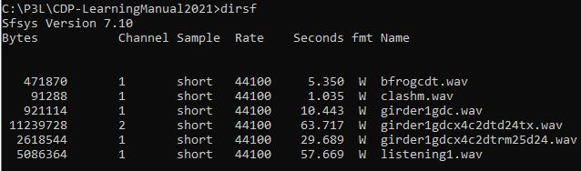
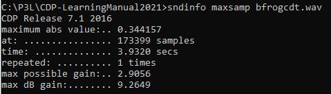
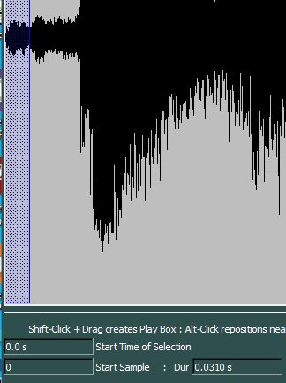
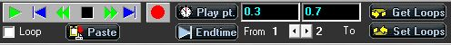
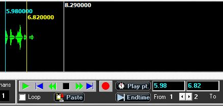
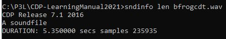

# Basic Soundfile Editing

*by Dr Archer Endrich*

*These are used all the time. It is assumed that you will be using one of the GUIs and will call up the process being discussed. Otherwise, enter the program name (given in CAPS) on the command line to call up its usage.*

| [**DIRSF**](#DIRSF) – Display the soundfiles in a Directory | | |
|---|---|---|
| [**MAXSAMP**](#MAXSAMP) | [**GAIN**](#GAIN) | [**CUT**](#CUT) |
| [**DOVETAIL**](#DOVETAIL) | [**SFLEN**](#SFLEN) | [**COPYSFX**](#COPYSFX) |

There are a few operations on soundfiles that are needed frequently.

- **List soundfiles –** {#DIRSF} DIRSF is a command line program that displays all the soundfiles in the current directory, providing information about them: number of bytes and channels, sample type and rate, duration in seconds and name. The screen below shows such a display.

  

  It is useful to see all of this information for all the soundfiles in a directory at once, for example to quickly see the length and number of channels of a number of files you are about to put into a mix. This is one reason why I like to have a CLI open when I'm working.

  The GUIs do not list soundfiles in this way, restricting what is shown to files currently open in the GUI. However, many specific information options about those soundfiles are available, as shown below for MAXSAMP. DIRSF is one of the information options available in SSh (`Info > (SOUND) FILES > 'List files (DIRSF)`), but it only shows the temporary name of the current open soundfile(s) as assigned by SSh.

- **Maxsamp –** {#MAXSAMP} SNDINFO MAXSAMP displays the highest amplitude level in the soundfile and indicates what maximum *gain* factor can be applied. It is important to know what the level of a sound is:
  - to ensure that there is good signal with which to work,
  - to match levels with other sounds,
  - to allow headroom when a sound process internally alters the signal level, such as filtering, brassage or multi-event textures
  - and to avoid overload when mixing

  The next screen shows what information is displayed:

  

  Access soundfile level information as follows:
  SL: First highlight a soundfile in the central panel. Then click on `SELECTED FILES ONLY > PROPERTIES` (and select `Maxmimum sample(s)`)
  SSh: You will have already opened a soundfile. Click on the `INFO` button at the right of the main screen (and select `Max Level (whole file)`) OR *via* the 'Info' tab in the navigation bar at the top `Info > (SOUND) FILES` (and select `Max Level (whole file)`)
  On the command line: `sndinfo maxsamp filename.wav`

  The salient information consists of two items: **Maximum possible dB gain** and **Maximum possible gain factor**. It is the second of these that is used for the *gain* factor in MODIFY LOUDNESS Mode 1 (1.0 is full amplitude). Mode 2 is for dB gain (full amplitude is 0 and the range of the parameter is - or + 96). -96 is silence, and values above zero increase the amplitude. The MAXSAMP display provides the information you need to run GAIN.

- **Gain –** {#GAIN} MODIFY LOUDNESS Mode 1 - A multiplier (*gain* factor) is applied to the amplitude envelope, raising the level if > 1.0 and lowering the level if < 1.0. The display from SNDINFO MAXSAMP is your guide for an appropriate *gain* value. Re-running MAXSAMP again will tell you what the resulting level has become.
  SL: `Loudness->Gain` on the PROCESS menu.
  SSh: `EDIT/MIX->Level->Gain`.

  Try to start with source sounds that have a reasonable level. If they are too quiet to start with, pushing up the gain may reveal unwanted background sounds or create 'digital noise' (an edginess caused by sharp amplitude jumps between samples).

  Most of the time a fairly high signal level is maintained, usually somewhere between 0.707 and 0.9, and level adjustments are made during mixing when 'balancinh' the sounds (relative levels). In electroacousic music, the level of each soundfile is carefully controlled and 'normalisation' across the board (every sound at maximum level) is seldom applied. I normally record the level of a soundfile in my workbook after processing so that I already know what it is when it comes to mixing. This speeds up the balancing process.

- **Cut –** {#CUT} SFEDIT CUT Mode 1- Sometimes only a part of a sound may be needed or needs to be removed (such as a glitch at the start of the soundfile). A portion to extract and save as a separate soundfile can be isolated with a 'cut out and keep' operation:
  SL: `EDIT->CUT AND KEEP > cutout & keep > time in seconds`
  SSh: `Edit/Mix->EDIT->Cut (extract)`
  When the aim is to remove a portion of soundfile (excise), SFEDIT EXCISE Mode 1 is used:
  SL: `EDIT->CUT OUT AND DISCARD & remove segment > time in seconds`
  SSh: `Edit/Mix->EDIT->Cut (extract)`

  Mode 1 is usually used because the start and end times for the section to keep or remove are given in seconds. *Determining what these times are is an important task.*

  In SL, you already have a soundfile in CHOSEN FILES. The CUT procedure begins by selecting EDIT on the Process menu. You then see the options as above. When the Process window opens, you will see a button called 'Sound View'. This takes you to a graphic image of the soundfile. You block out the portion you want to keep or remove with Shift-Click+Drag. The start and end times (and duration) of this portion are displayed, and when you click on the OUTPUT DATA button in the right bottom corner of the window, these start and end times are automatically entered into the parameter boxes on the Process page, and you are returned to this page. Instructions for blocking out are given just below the soundfile display in the Sound View window. Here is an image of a blocked out portion:

  

  In SSh there are similar facilities. It all centres on the soundfile display window (main screen) where you see and play the soundfile. Note that there are a set of PLAY FROM buttons on the left side and PROCESS buttons on the right side of the soundfile display. These left and right panels have options that control how a selected portion of soundfile is handled. Underneath, to the right of the play transport are two boxes labelled 'Play pt.' If you click on 'L to R Marker' in the PLAY FROM panel and 'At Marker(s) in the PROCESS panel and fill in *start* and *end* times in the two boxes, PLAY (Green right-facing arrow on the Play transport) will play the portion between those markers (once or looped depending on your settings). You can then adjust the *start* and *end* times until the portion to cut and keep (or cut and remove, i.e. excise) is to your satisfaction. The next image shows the Play transport and the cut marker boxes:

  

  I usually start by setting 'Start of file' in the PLAY FROM panel and 'Whole file' in the PROCESS panel. Then I listen through the soundfile, noting the time(s) where I would like to make a cut – e.g. if I am cutting out different parts of a long source file to use as separate source files. Then I set 'L to R Marker' in the left panel and 'At Marker(s)' in the right panel and enter the *start* end *times* (in seconds only! – no minutes). Now Play will play between those markers, and I keep changing the *start* and *end* times until the portion I want to keep or excise is correct.

  The above procedure can be accomplished in a more directly graphic way. Rather than just listening and noting approximate times, you can click directly in the soundfile display. Left Button sets the Left marker (blue) and Right Button sets the Right marker (yellow). The section of soundfile between these two marks is the selected portion of soundfile. Click, hold and drag to move the marker lines, using the respective buttons: Left for Left marker, Right for Right marker. Put the times shown in the display in the Play pt. boxes..:

  

  The CUT process is completed in one of two ways: *via* the CUT button on the Right, under the PROCESS panel (which does cut & keep) or *via* `Edit/Mix > EDIT > Cut (extract)` or `Excise (discard)`. The newly formed (temporary) soundfile now appears in the soundfile display window and you can audition it.
  - If the result is OK, SAVE the soundfile, giving it a new name. This name will appear in the selected soundfile box and should play. (If it doesn't, click on the 'OPEN Soundfile Player' icon at the top (a little loudspeaker image).
  - If the result is not OK, without saving the cut portion, highlight the cell in the PATCH Grid where the CUT operation has been recorded and delete that cell. When you Play the soundfile again (Green button), the original soundfile is still there and you can resume the CUT procedure.
  - If you save the CUT soundfile (to a new name) and then delete the CUT cell in the PATCH Grid, you are returned to the original file (click on 'Start of File' in the PLAY FROM panel and 'whole file' in the PROCESS panel to return to auditioning the whole file).
  - Ensure that 'Start of file' and 'Whole file' are ticked before next performing an operation that uses a whole sound.

  For more detailed and the latest information on CUT in Soundshaper using markers, see its Reference Manual: Basic Operation -> Markers -> Edit at Markers, and Main: Other Features -> markers.

- **Dovetail –** {#DOVETAIL} ENVEL DOVETAIL - A soundfile or a cut portion of a soundfile may have transients at the beginning and/or end that are sharper than desired. These can be smoothed: the amplitude gradually increases or decreases, a process which is one aspect of 'enveloping'. In the classical tape studio, it was done with a splicing block (or scissors!), so the fades are sometimes referred to as 'splices'. Many software packages offer handy graphic solutions. The CDP approach is to listen to the sound and then aurally imagine how much time should be taken over the fades.

  SL: `ENVELOPE->dovetailing`
  SSh: `Soundfiles->ENVELOPE->Fades`

  The durations of the in and out fades are given in seconds (start and end of the file) and there is a choice between linear (steady change) and exponential (increasingly rapid) fades.

  The fades can be very short for minimal change, or rather long, for smooth transitions from and to silence. Long fadeins and fadeouts can be used when creating passages in TEXTURE that seamlessly weave sounds together.

- **Sflen –** {#SFLEN} SNDINFO LEN - Especially when preparing for a mix, it is vital to know the length of the soundfiles so that the timing of overlaps can be planned, and levels adjusted when several soundfiles overlap.

  

  SL: `SOUND INFO->duration`
  SSh: you can use the `INFO->File Properties` button in the main window just to the right of the Play transport.

- **Copy soundfiles –** {#COPYSFX} COPYSFX is an important Utility program written by Richard Dobson. By default the copy is in the same format as the original. COPYSFX adheres to the standard wav format, which is not always the case with other software. Sometimes a soundfile created with other software will not open in CDP, usually because the header is non-wav-standard. The solution to this is to use COPYSFX to make a copy of the soundfile, because in doing so, a wav-compatible header will be created and the soundfile will work with the CDP software.

  Available sample types are 16bit integers (shorts), 32bit integers (longs), 32bit floating point and 24bit integer 'packed'. A variety of soundfile formats are supported (.wav, .aif, .afc, .aifc, generic WAVE_EX, and WAVE_EX mono, stereo, quad, quad surround, 5.1 format surround, Ambisonic B-format, 5.0 Surround, 7.1 Surround, CUBE surround and 6.1 Surround.

  If you using a CLI, you can quickly see the full Usage simply by entering COPYSFX <Return>.
  SL: I cannot find COPYSFX among the *Sound Loom* program options.
  SSh: `Edit/Mix > SF UTILS > Copy/Convert ('COPYSFX')`

---

Last updated: 18 August 2022
(c) 2022 Archer Endrich Plymouth UK
