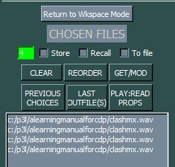
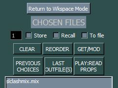
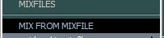
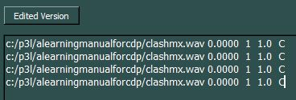
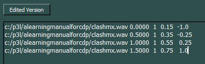
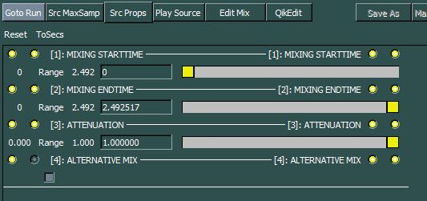

# Create a Mix in Sound Loom

*by Dr Archer Endrich*

*Concise, with troubleshooting information*

| [A Simple Mix](#SIMPLEMIX) | | |
|---|---|---|
| [Synopsis](#SLSYNOPSIS) | [Two Options](#TWOOPTIONS) | [Mix Syntax](#SYNTAX) |
| [Common Pitfalls](#COMMONPITFALLS) | [Supplementary Programs](#SUPPLEMENTARYPROGRAMS) | |

## A Simple Mix {#SIMPLEMIX}

**Illustration: A Simple Mix: *slclashmix.mix***

```
path                           sfilename   time    chans level pan
c:\p3l\ALearningManualforCDP\clashmx.wav  0.0000  1     0.15  -1.0
c:\p3l\ALearningManualforCDP\clashmx.wav  0.5000  1     0.35  -0.25
c:\p3l\ALearningManualforCDP\clashmx.wav  1.0000  1     0.55   0.25
c:\p3l\ALearningManualforCDP\clashmx.wav  1.5000  1     0.75   1.0
```

This mix repeats the same mono soundfile four times at regular 1/2 sec. time intervals. The amplitude increases with each repetition, and the sound moves from left to right: [slclashmix.wav](../sounds/slclashmix.wav).

## Synopsis {#SLSYNOPSIS}

**Synopsis of the procedure to create a mix from scratch:**

It may be helpful for you to actually perform a mix while going through this synopsis of the mix procedure. So we shall re-create the simple mix shown above, step by step. The source file [clashmx.wav](../sounds/clashmx.wav) is provided. You will need to have *Sound Loom* set to your Learning Manual directory (or have *clashmx.wav* in the directory which you choose to use).

- Move the sounds you are going to mix into CHOSEN FILES. If you move the same sound again, you are given a warning, but told that it is OK when mixing. Here is an image of the four copies of *clashmx.wav* ready for mixing.

  

- Select Process `MIX->create mixfile ... superimposed` – and Save the mixfile

  

- Staying in CHOSEN FILES, remove the soundfiles from CHOSEN FILES and

- Put the newly created mixfile into CHOSEN FILES

  

- Select Process `MIX->mix from mixfile`

  

- Select `Edit Mix` and edit start times, levels and pan

  

- Click on `Edited Version` (it is automatically re-saved)

  

- Run the Mix

  

- Play back the result and Save the soundfile if OK

  

  

## Two Options {#TWOOPTIONS}

**MIX procedure: there are two options**

- **No mixfile, starting from scratch** – The **first option** is to put the sounds you want to mix into CHOSEN FILES and then use `PROCESS  -> MIX-> create a mixfile -> superimposed`. This procedure is described in the section above.

- **Already have a mixfile** – The **second option** can be used if you already have a mixfile. Put the mixfile into CHOSEN FILES and then use `PROCESS -> MIX -> MIX FROM MIXFILE`. Remember that you can edit this mixfile while on the process page via the `Edit Mix` button, and then click on `Edited Version` which saves the edits and returns you to the Mix page. If there are errors in the mixfile, the MIX process button may remain inactive. See 'Common Errors' below.

**An aside** – Although it is working fine on my MacBook Pro, you may possibly experience a problem on the MAC in activating the cursor in the mixfile in order to edit it. The workaround is to create the mixfile from scratch with a text editor, saving it to *aname.mix* in your current working directory. If the text editor adds **.txt** to this, rename it, removing the **.txt** and leaving the **.mix** so that the CDP software can recognise it as a mixfile. Refresh the directory and then GRAB the mixfile you have made for use on the Workspace, and from there to CHOSEN FILES.

## Mix Syntax {#SYNTAX}

**Mix Syntax**

To revise mixfile syntax, see the *Files & Formats* document link in the Reference Documentation (**../docs/html/filestxt.htm**) (`CHARTS->FILE FORMATS`). The example above gives the basic information. Note that mixfiles can contain both mono and stereo soundfiles, the start times can be in any order, and the same soundfile can be used more than once. In *Sound Loom* the full path to the sounds in the mixfile is required, but the .wav extension is optional. *Sound Loom* handles both backslashes and forward slashes.

## Common Pitfalls {#COMMONPITFALLS}

**Common Pitfalls**

There are a few mishaps that can occur when creating mixfiles. The MIX Process button may not highlight or an error message may be displayed when the mixfile is run. Here are some potential causes.

- The path to the soundfiles is missing in the mixfile, even if the sounds are in the current directory: the full path is required. To test this I deliberately left out the path for one of the soundfiles. MIX ran but displayed this (obscure) error message: "INTERNAL_ERROR: (Bug?) type_conversion not done for this process: redefine_textfile_types0". However, the mixfile ran OK on the command line without one of the paths, so this error is generated by *Sound Loom*, not by the MIX program itself. If a soundfile to be mixed is NOT in the current directory, the path is definitely needed for command line use.

- There is a soundfile in the CHOSEN FILES panel as well as the mixfile when you go to mix: MIX will not be highlighted in the Process menu.

- A soundfile name is mis-spelled

- The 'soundfile' is acually an analysis file

- The number of channels given in the mixfile does not match the number of channels in that soundfile. On the command line, this error message was delivered: "WARNING: If testmix.mix is a mixfile: c:\p3l\cdp-learningmanual2021\clashmx.wav is not a stereo sndfile. Application doesn't work with this type of infile."

- the mix overloads: you are asked if you want to run it again, and a level is suggested? (or is that Texture?)

- only one set of *level* and *pan* is given when it's a stereo soundfile

MIX does a pretty good job of maintaining an output level that does not overload. If the levels of the input sounds or the levels specified in the mixfile are high, you might want to check the level of the output sound before playing it. I tried specifying all the levels in the 'simple mix' example above at 3.0 (1.0 is full amplitude) and the level of the output soundfile was nevertheless an acceptable 1.0.

## Supplementary Programs {#SUPPLEMENTARYPROGRAMS}

**Some of the SUBMIX MIX programs that facilitate putting together a mixfile**

- FILEFORMAT – displays the format of mixfiles

- DUMMY – convert a list of sound names to a basic mixfile ready for editing (it starts off with default values); the sound names are entered *via* the program and there are 3 modes (all start at time 0: Mode 1; each file starts where the previous file ends: Mode 2; and (for mono files) the first file is placed on the left and the rest of the files on the right: Mode 3

- ADDTOMIX – add soundfiles to an existing mixfile; the sound names are entered *via* the program

- ATSTEP – add soundfiles to an existing mixfile at a fixed time step seconds)

- ATTENUATE – alter the overall level of a mixfile

- FADERS – mix several soundfiles using a time-varying level-balance function; the soundfiles can be either Mono or Stereo but not mixed in the same mixfile; this program requIres text data files for *balance-data* and *envelope-data* and is quite a powerful tool

- GETLEVEL – tests the maximum level in a mix and suggests a gain factor to avoid overload, i.e., prior to carrying out the mix operation

- MODEL – replace soundfiles in an exising mixfile

- SHUFFLE – shuffle the data in a mixfile

[**RETURN**](index.md#TOPIC3) to A Learning Manual for CDP, Topic 3

---

Last updated: 25 August 2022
