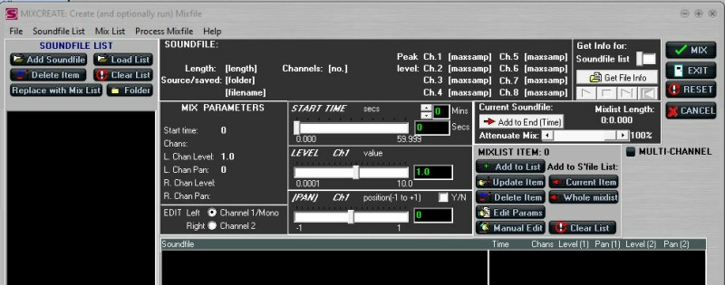
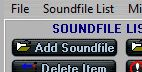
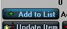
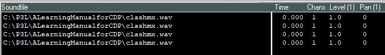
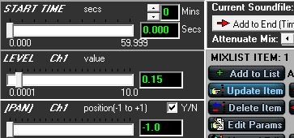
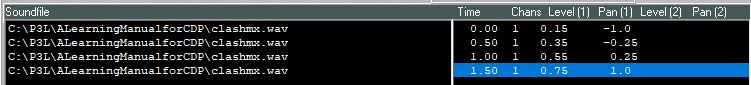
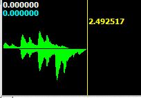
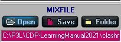

# Create a Mix in Soundshaper

*by Dr Archer Endrich*

*Basic operational procedure (one of several possible)*

| [A Simple Mix](#SIMPLEMIX) | [MIX Procedure Synopsis](#SSHSYNOPSIS) |
|---|---|
| [Re-edit a Mix](#REEDITAMIX) | [Alternative Methods](#ALTMETHODS) |

## A Simple Mix {#SIMPLEMIX}

**Illustration: A Simple Mix: *clashmixSSh.mix***

```
path                           sfilename   time    chans level pan
c:\p3l\ALearningManualforCDP\clashmx.wav  0.0000  1     0.15  -1.0
c:\p3l\ALearningmanualforCDP\clashmx.wav  0.5000  1     0.35  -0.25
c:\p3l\ALearningmanualforCDP\clashmx.wav  1.0000  1     0.55   0.25
c:\p3l\ALearningmanualforCDP\clashmx.wav  1.5000  1     0.75   1.0
```

This mix repeats the same mono soundfile four times at regular 1/2 sec. time intervals. The amplitude increases with each repetition, and the sound moves from left to right: [clashmixSSh.wav](../sounds/clashmixSSh.wav).

## MIX Procedure Synopsis {#SSHSYNOPSIS}

**Synopsis to create a mix from scratch (*Soundshaper* 5.05):**

It may be helpful for you to actually perform a mix while going through this synopsis of a mix procedure. So we shall re-create the simple mix shown above, step by step. The source file [clashmx.wav](../sounds/clashmx.wav) is provided. You will need to have *Soundshaper* set to your Learning Manual directory (or have *clashmx.wav* in the directory which you choose to use). For reference, this is what the whole *Soundshaper* mix window looks like before anything happens:



**Basic Procedure**

1. Select `Edit/Mix->Mixfile->Create/Edit Mix (off grid)` (without first opening a soundfile). (Grid Cell A0 may first need to be emptied: if so, click on it and press Delete on your keyboard.)

2. Use the button `Add Soundfile` on the left to select soundfiles to mix.

   

   These then appear with their names in the SOUNDFILE LIST panel. Select clashmx.wav.

3. Now click on the button `Add to List` over towards the right hand side. This puts it in the main window ready for editing the mix parameters. You could edit the parameters right away before clicking on `Add to List`, but this time we'll put all the soundfiles in the list first.

   

4. Repeat steps 2 and 3 three times so that four instances of clashmx.wav are in the mix. This is what the central panel will look like before editing any of the parameters.

   

   You will notice that all the parameters have the same values. The first soundfile is highlighted so that its parameter values can be edited.

5. You now adjust the values for *starttime*, *level* and *pan*. Note that 'Peak level' is displayed at the top for your information. The editing can be done with the MIX PARAMETERS panel. You can enter the values as in the simple mix example at the start of this file, or do something different, such as make it pan from R to L instead of L to R, fade instead of get louder, make the sounds closer together or further apart.

   

   Now the values are shown as edited in the image. When you click on the `Update Item` button, these values are written on the main screen. This button is highlighted in the above image to show that it has been done.

6. Repeat highlighting the soundfiles and editing the parameters for each of the soundfiles. Now that all the parameters have been set, the main mix window should look like this:

   

7. You can now MIX these soundfiles *via* the MIX button at the top right – a dialogue will ask if you want to save the mixfile. Click YES and save the mix to a mixfile (you give it a name). This mixfile can be opened again in the MIX window for further tweaking. Having clicked on the MIX button and saved the mixfile (or not), you are immediately returned to *Soundshaper's* main window, displaying the soundfile that you have just created. If it doesn't display, click on the Play button, which should be green (active).

   : [ClashmixSSh.wav](../sounds/ClashmixSSh.wav)

   After listening to the soundfile, you can save it or return to the mix to make adjustments.

8. Suppose you don't like what you hear and want to make some changes to the mixfile – a probable event. The next section describes re-editing the mixfile, either right away or later.

## Re-Edit a Mix {#REEDITAMIX}

**First option: re-edit as soon as you've auditioned a mix.** – Double-click on Grid cell A0 (or on whichever cell your mixed sound has been placed).

- When you do this, you are first warned that if you load a new mixfile, the (current) mix list will be cleared. Answer NO because you want to work with the current list (that you had just created).

- You are returned to the MIX page, with your soundfiles and existing parameter values in place. You can now make your edits as above, either using the MIX PARAMETERS panel and `Update Item` or directly on the mix list display by double-clicking on the parameter, in which case the parameters are updated when you click on the `CLOSE` button.

- If you save the revised mixfile, you can overwrite the existing one or give it a new name. The mixfile goes into directory set in your .evt for your data files. This could be the current working directory or the default TXT\MIX.

**Second option: re-edit a saved mixfile later**

- Again start with `Edit/Mix > MIXFILE > Create/Edit Mix (off grid)`. This opens the MIX window.

- The next step is to open your saved mixfile, using the `Open` button:

  

  This restores the list of soundfiles to mix and the parameters as previously set.

- Now edit the parameters as above, save the revised mixfile and MIX.

- Audition and repeat as needed.

Note that the *level* and *pan* parameters will only balance and position the soundfiles in the mix. *To achieve time-varying amplitude or pan changes, pre-process the file with PAN before mixing.*

## Alternative Methods {#ALTMETHODS}

**Alternative methods**

- There are other ways to enter *Soundshaper's* MIX facilities. I have chosen to describe my preferred method. For the full rundown of MIX in *Soundshaper*, see Robert Fraser's *MixPageMar18.pdf*, which is located in `CDPR7\Soundshaper5.0\Docs`.

- Command line: Using a text editor, create a mixfile in the directory where the sounds you want to use are located, with path, soundfilename, start time, number of channels, level and pan parameters set for each soundfile. You can run this directly from the command line with the command `SUBMIX MIX mixfile.txt outmixfile.wav`, OR, you can `Open` this mixfile in *Soundshaper* as above, etc.

[**RETURN**](index.md#TOPIC3) to A Learning Manual for CDP, Topic 3

---

Last updated: 25 August 2022
