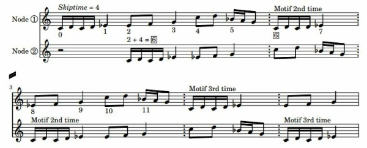
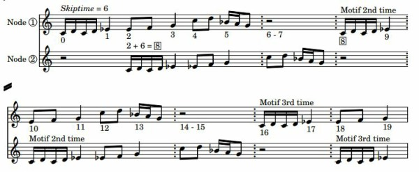
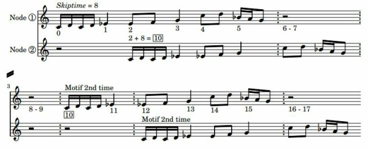

# Getting a grip on *Packing* & *Skiptime*

*by Dr Archer Endrich*

*Tricky but crucial TEXTURE parameters. This document links to sound examples.*

| | | |
|---|---|---|
| [**Introduction**](#PANDSINTRO) | [***Packing***](#PACKING) | [***Skiptime* Introduction**](#SKIPTIMEINTRO) |
| [**NDF for Examples 1**](#SKIPTIMENDF1) | [**NDF for Examples 2**](#SKIPTIMENDF2) | [**NDF for Examples 3**](#SKIPTIMENDF3) |
| [**NDF for Examples 4**](#SKIPTIMENDF4) | [**SUMMARY and suggestions**](#PANDSSUMMARY) | |

## INTRODUCTION {#PANDSINTRO}

I find *packing* clear enough: it is an event density parameter. However, I have worked for days on the *skiptime* parameter, writing out the musical result of certain settings longhand and comparing the aural and written results. This is not easy because of the complexity of textures that can occur. Using two different sound sources helps.

My conclusion is that *skiptime* does exactly 'what it says on the tin': **the timed gap always starts at the *beginning* of the last time in the rhythmic template or motif if no nodal substructure, or the start time of the *last node* in a nodal substructure ('line')**. *Skiptime* is not setting the duration of this last event, but rather *the time between the start of this last event and the repeat of the whole motif or sequence*. The actual length of this last event is set by the template or motif itself. The motif can be both shorter or longer than *skiptime*, meaning that there will be a gap if shorter or overlap if longer.

Remember that the TEXTURE programs repeat the input sound *from its beginning* up to the length of the *duration* specified, or uses the 'whole sound' if this is selected: *for each sound event created*. BRASSAGE – and *Grainmill* – are different: they work their way through the whole input sound only once. Also bear in mind that there can be more than one input sound and more than one motif.

The following aspires to provide clear illustrations of how *packing* and especially *skiptime* work. At the end, there is a summary of the variable factors available when using these functions.

## *PACKING* {#PACKING}

The ***packing*** parameter specifies the time between note events (i.e., iterations of the sound). The next iteration can come, for example, half-way through the duration of the input sound, causing overlaps – or only 0.1 seconds after the start of each previous iteration, causing an extreme overlap, or perhaps a second or so after each iteration has finished: when *packing* is longer than the note event, it leaves a gap.

*Packing* is prominent in TEXTURE SIMPLE. It is also used in TEXTURE MOTIFS/MOTIFSIN. In MOTIFS/MOTIFSIN you can use it to make your melodic motifs overlap. (If the gap is small, you will get a dense texture, so some attenuation (level reduction) may be needed to avoid amplitude overload.) Tidy rhythms, dancing interactions and wild textures are all possible.

Keeping rhythms on the beat is an issue. To do this, packing has to be equal to or an even multiple of the duration of a note event at a given tempo.

## *SKIPTIME* {#SKIPTIME} – General Observations

***Skiptime*** is another kettle of fish. It is used in TIMED, TMOTIFS, TMOTIFSIN, DECORATED and its PRE- & POST- forms, and in ORNATE and its PRE- & POST forms. However, it does precisely "what it says on the tin." The Reference documentation states that ***skiptime* is the time between "runs of the 'line' substructure notelist", i.e., the 'nodal substructure', *and it begins on the last time-node of the 'line'***. A rhythmic template for TIMED or TMOTIFS operates in the same way: *skiptime* starts at the last time of the template, but it differs from 'nodes' in that the template cannot be made to overlap when it repeats.

While *skiptime* does start on the last substructure node, planning for overlaps (or none) also needs to take into account how much the motif extends beyond this last substructure node – and whether or not the sound rings on for a bit.

The section below gives a number of examples with resulting sounds to illustrate *skiptime* in action. **Understanding this one parameter can greatly ease the use of this part of the TEXTURE Set**.

***Skiptime* always starts at the beginning of the last time in the rhythmic template or nodal substructure ('line').** NB: When there is a nodal substructure, this 'last time' is the last time in the NODAL substructure, NOT the last time/note of a motif attached to it.

## EXAMPLES 1 {#SKIPTIMENDF1}: *skiptime* in TEXTURE TIMED.

TEXTURE TIMED Mode 5, with note data file *ndftimed.txt*:

```
60            ;the nominal pitch (pitch reference) is set at Middle-C
#3            ;three lines of rhythmic template
0.0 1 0 0 0	;first note even tis a crotchet at crotchet = 60
1.0 1 0 0 0	;second note event is a quaver
1.5 1 0 0 0	;starts at 1.5 sec. but skiptime determines 'how long'
```

If thinking about durations in numbers like this is a problem, please see [*Duration as Number.pdf*](data/Duration as Number.pdf)

RESULTS (listen and tap the beats):
Any overlaps with this program mainly result from a sound that 'rings on' longer than the *skiptime*, which can't go below zero. The duration of the source marimba sound is 1.0 sec. but mostly dies away within half a second.

- [martimedskip0_5.wav:](../sounds/martimedskip0_5.wav)
  *skiptime* = 0.5 so that it is half a second before the rhythm repeats: the rhythm repeats end-to-end without a pause

- [martimedskip1_5.wav:](../sounds/martimedskip1_5.wav)
  *skiptime* = 1.5: there is a one second pause between repeats: half a second for the last stroke on the marimba, then a full second before the rhythm repeats

- [martimedskip0_1.wav:](../sounds/martimedskip0_1.wav)
  *skiptime* = 0.1: sounds like double-strokes – can you work out how this 2nd quick note gets there? – and why it repeats without *two* long strokes before the double-stroke?

## EXAMPLES 2 {#SKIPTIMENDF2}: *skiptime* in TEXTURE TMOTIFS, which has a rhythmic template AND a motif.

TEXTURE TMOTIFS Mode 5, with note data file *ndftmotifs.txt*:

```
60
#3                ;three lines of rhythmic template
0.0 1 0 0 0	  ;crotchet
1.0 1 0 0 0	  ;quaver
1.5 1 0 0 0	  ;quaver (but skiptime determines 'how long' this is)
#2                ;two lines to define a rhythmic motif
0.00 1 60 90 0.5  ;semiquaver
0.25 1 62 60 0.5  ;semiquaver (unless source sound rings on)
```

RESULTS:
(A 2-semiquaver rhyhmic motif is 'attached' to each 'note' of the rhythmic template.)

- [martmotifsskip0_5.wav](../sounds/martmotifsskip0_5.wav)
  *skiptime* = 0.5: the motif is heard 3 times, once on each 'note' of the rhythmic motif; then it repeats without a pause. (Remember, *skiptime* 0.5 starts at time 1.5 of the rhythmic template.)

- [martmotifsskip1_5.wav](../sounds/martmotifsskip1_5.wav)
  *skiptime* = 1.5: the motif is heard 3 times, once on each 'note' of the rhythmic motif; then there is a one second pause. This pause reduces the rhythmic ambiguity by signalling when the first note of the motif occurs.

## EXAMPLES 3 {#SKIPTIMENDF3}: *skiptime* in TEXTURE POSTORNATE, which has a nodal substructure AND a motif.

TEXTURE POSTORNATE Mode 5, with note data file *ndfp_ornate1.txt*:
(The motif is shorter than the time between nodes.)

```
60
#2               ;two lines of nodal substructure ('line')
0.0 1 60 0 0	 ;minim
2.0 1 60 0 0	 ;minim -- but skiptime will shorten or lengthen the time
#2               ;two lines of a rhythmic motif
0.00 1 60 90 0.5 ;semiquver
0.25 1 62 60 0.5 ;semiquaver (but skiptime determines 'how long' this is)
```

RESULTS (count at 1 whole second per beat to hear it correctly):

- [marp_ornate1skip2.wav](../sounds/marp_ornate1skip2.wav)
  *skiptime* = 2: the semiquaver motif is attached to each nodal minim, with in effect a dotted crotchet rest between minims because the sound is short. It repeats without a pause.

- [marp_ornate1skip4.wav](../sounds/marp_ornate1skip4.wav)
  *skiptime* = 4: now there are 2 additional seconds of pause before the repeat

## EXAMPLES 4 {#SKIPTIMENDF4}: *skiptime* in TEXTURE POSTORNATE, which has a nodal substructure *AND a motif longer than the time between nodes*

TEXTURE POSTORNATE Mode 5, with note data file *ndfp_ornate2.txt*:
(Now the motif, 6 seconds at crotchet = 60, is longer than the duration of the two nodes (4 seconds) – though the actual length of the 2nd node is in fact set by *skiptime*. The '2.0' time is just when the second node begins. Note that this second node is MPV 72 and the second iteration of the motif will be an octave higher.)

```
60                 ;reference pitch
#2                 ;2 lines of nodal substructure
0.0 1 60 0 0       ;the first node is on Middle-C
2.0 1 60 0 0       ;as is the second node -> canononic on same pitch
#13                ;13 lines of motif (NB beat count vs. time in seconds count)
0.00 1 60 90 0.3   ;beat 1, time 0 sec.
0.25 1 62 60 0.3
0.50 1 60 66 0.3
0.75 1 62 72 0.3

1.00 1 63 90 1.0   ;beat 2,  time 1 sec.

2.00 1 63 88 0.5   ;beat 3,  time 2 sec.
2.50 1 65 84 0.5

3.00 1 67 96 1.0   ;beat 4,  time 3 sec.

4.00 1 72 96 0.5   ;beat 5,  time 4 sec.
4.50 1 74 88 0.5

5.00 1 70 90 0.3   ;beat 6,  time 5 sec.
5.25 1 69 82 0.3
5.50 1 67 84 0.5
```

RESULTS: (See [*Skiptime468.pdf*](data/Skiptime468.pdf) to see musical notation for the beginnings of Examples 2, 3, 4 and 5.)

1. [marp_ornateskiptime_1.wav](../sounds/marp_ornateskiptime_1.wav)
   *skiptime* = 0.1: The motif comes in again at time 2 seconds as defined by the nodal substructure. However, the timegap being only 0.1 seconds, the motif for the first node then begins again a 10th of a second later. Because the duration of a semiquaver at crotchet = 60 is 0.25 seconds, the effect is a double-stroke on each pitch.

2. [marp_ornateskiptime2.wav](../sounds/marp_ornateskiptime2.wav)
   *skiptime* = 2: This makes the timegap after the start of the second node the same as the time between nodes. Thus the motif is going to repeat regularly every two seconds on each node. This produces several regularly overlapping parts and one section of the motif keeps getting repeated.

3. [marp_ornateskiptime4.wav](../sounds/marp_ornateskiptime4.wav)
   *skiptime* = 4: This produces an end-to-end repetition of the motif because 2 + 4 = 6: the motif for the first node (the sequence iteration) begins again on beat 6, the next beat after the last beat of the motif. Meanwhile the motif on the second node has started at time 2 sec., so the entry of the motif on the first node occurs at its beat 5: this is where the overlap begins. A section of the motif repeats, but 2 seconds longer than when *skiptime* was 2.

   **Music Notation for *skiptime* = 4**
   

4. [marp_ornateskiptime6.wav](../sounds/marp_ornateskiptime6.wav)
   *skiptime* = 6: *Skiptime* begins at the start of the last node, in this case node 2 at the 2 second mark. As *skiptime* is 6, it now extends the time 2 seconds longer than the 6-second long motif that began on node 1 at time 0.0: node 2 at 2 sec. + *skiptime* 6 = time 8 sec. Thus we hear the last two beats of the motif on node 2 on its own, and then we hear the sequence repeat (i.e., the motif on node 1) at time 8 seconds – its first two beats on their own because *skiptime* is now applied to the node 2 motif – whereupon the motif on node 2 comes in again on beat 10. (Note that sometimes a sequence will end with only one motif on its own, when an overlap might be expected. This is because *outdur* is reached before the second motif can come in again. The first motif has already begun, so plays to its end.)

   **Music Notation for *skiptime* = 6**
   

5. [marp_ornateskiptime8.wav](../sounds/marp_ornateskiptime8.wav)
   *skiptime* = 8: We hear the 6-beat motif come in again as expected on the second node at 2 seconds. However, now node 2 at 2 sec. + *skiptime* 8 = 10, so the motif on the first node won't come in again until the 10th second, meaning that there will be a 4 second gap between the end of the motif on the first node and when it comes in again, and a 2 second gap between the end of the node 2 motif and when the sequence repeats. The motif on node 2 then comes in at time 12 sec.

   **Music Notation for *skiptime* = 8**
   

6. [marp_ornateskiptime2tporange.wav](../sounds/marp_ornateskiptime2tporange.wav)
   *skiptime* = 2: In this example, *multilo* is 1 (1 crotchet = 1 second) and the high tempo *multhi* is 0.5 (twice as fast). On the iteration of each motif, the program selects a tempo within this range, leading to varied and unpredictable rhythmic configurations.

7. [marp_ornateskiptime2tvtpo.wav](../sounds/marp_ornateskiptime2tvtpo.wav)
   *skiptime* = 2: This time, tempo is handled by two time-varying breakpoint files. *Outdur* is 12 seconds, so the changes are spread over this duration. File *POtempoLo.txt* for *multlo* goes faster towards the centre and back again. File *POtempoHi.txt* for *multhi* goes slower towards the centre and back again. The tempo during each iteration remains the same, but a different tempo is selected along these two tempo 'curves', creating supple rhythmic relationships.

```
  POtempoLo.txt   POtempoHi.txt
   0.0  1         0.0   0.5
   6.0  0.5       6.0   1.0
  11.0  1         11.0  0.5
```

8. [marp_ornate2serendipity.wav](../sounds/marp_ornate2serendipity.wav) (NB - based on a different tune)
   *skiptime* = 2, *multlo* is 0.9 and *multhi* is 1.0. Each iteration starts at a tempo at or somewhere between these two tempos. Although a very small difference in tempo, the rhythmic overlaps are nevertheless supple and unpredictable. Adding another motif or two and/or another source sound or two, things ramp up considerably. Your compositional aesthetic becomes the determining factor. Hard as it is to hear just what is going on, it will still doing "what it says on the tin."

## SUMMARY {#SUMMARY} of variable factors when using *packing* or *skiptime*

This document has tried to illustrate these two crucially important parameters in the TEXTURE Set. The examples have been as aurally simple as possible to facilitate hearing what is going on and to demonstrate that the software does "what it says on the tin.". However, this is just the beginning of what is possible.

First of all there is the matter of the design of the motif(s) – there can by many, and TEXTURE will select at random from the list of defined motifs. Their composition will be based on your harmonic and melodic preferences, and, when overlaps are involved, on a certain amount of canonic technique. Designing for rhythmic interactions also comes into it. My favourite so far is Example 20 of Tutorial Workshop 2. It is not a trivial exercise, and CDP does not hand out solutions on a plate.

When multiple motifs and multiple source sounds are employed, things ramp up considerably.

The simplest *packing* would be repeating a sound at the same pitch at a constant density. One thing to bear in mind when pitch constant values or time-varying pitch breakpoint files are used with a harmonic set, the range of the set must match the constant values or time-varying values that might be produced. For example if a node starts at 72 and the range of the motif is 7 semitones, the pitches defined in the harmonic set must extend to MPV 79. Here are some additional ways that a note-event texture produced by *packing* can be shaped.

- time-varying *packing* (density control)
- use of *tgrid* to quantise event onsets
- time-varying specified note-event durations
- time-varying upper and/ lower pitch breakpoint parameters
- time-varying dynamics (velocity)
- time-varying spatial positioning (*position* and *spread*
- more than one input soundfile, played cyclically in sequence or with a randomised sequence
- specify in a breakpoint file when the input soundfiles are to be used
- map textures to a specified Harmonic Field or Set to create some form of harmonic sonority

The simplest *skiptime* application would be to create a canonic texture that repeats a motif at a given overlap point, starting at the same pitch as in the examples above. The compositional potential of the TEXTURE Set programs that use *skiptime* starts to become manifest when considering all the other variable factors that are available. (It might be helpful to revise [*Texture Set - Key Components*](texture-set-key-components.md)).

- have each note start on a different pitch to create sonorous or dense textures
- more than one input sound chosen at random or linked to specified times
- playing with the tempo 'lo' 'hi' parameters
- vary the time-distance between nodes of the nodal substructure ('line') and balance this with *skiptime*
- crate a variety of motifs designed to interact rhythmically
- make use of a Harmonic Set that changes at a specified time point (or points)
- take care over the specification of velocity in a motif, such as by giving emphasis to the initial notes of the motif: this helps with rhythmic clarity – otherwise the rhythms will tend to fuse together (which could be another objective)
- work with the spatial positioning and the input soundfile parameters as shown above for *packing*
- how about this? *skiptime* is time-varying

---

Last updated: 25 October 2021
