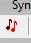

# How to Save and Backup Soundfiles

*by Dr Archer Endrich*

*with workflow suggestions*

| [General Observations](#INTRODUCTION) | [Commandline](#CMDLINESAVE) |
|---|---|
| [Sound Loom](#SLSAVE) | [Soundshaper](#SSHSAVE) |

## General Observations {#INTRODUCTION}

Saving our work is an essential part of working with sound. Having determined the sample rate at which one wants to work, such as 44.1, 48, or 96, CDP's Save functions automatically maintain that sample rate.

One consideration is to have a clearly laid out working environment. The requirements for this will differ according to the magnitude of the project. The starting point is a working directory dedicated to that project. Depending on the complexity of the project, this working directory can be further divided into subdirectories for sources, transformations of a particular kind, mixes and *sim.*.

Another consideration concerns the creation of file names. Some kind of consistency is the key, and this can include both soundfiles and the various kinds of text files. I like to build families of names on a concise root name for a given source soundfile. For example, if the source were a suspended cymbal, I might create the root name 'scym' and both soundfiles and associated textfiles would make use of this root. Some prefer to use poetic names descriptive of the sound produced. My preference is to use abbreviations for the processes used, and sometimes a key parameter value.

For example if I transpose the suspended cymbal source down an octave, my practise is to add 'd12' to the name, forming 'scymd12.wav'. If I then cut the sound and enveloped it with DOVETAIL, I would add 'cdt' to the name, making it 'scymd12cdt.wav'. Someone else might like to name the sound 'lowwash.wav', but I like to be able to read, at least to some extent, the history of transformations that went into it. My names are unreadable as words but highly informative as standard abbreviations.

A third consideration is keeping some form of record of what you have done. It is not easy to recall how a sound got to be what it is, even after a day or two, and if it's a particularly good result, the how of it is useful information for the future. Both GUIs can produce logs of sessions. In addition to these, I like to jot things down in a hardback notebook as I go along, sometimes more, sometimes less. I find it extremely useful to look back through my notesbook(s) while working on a project or some time later to see how key sounds were made, annotated results of different parameter values, levels, and mix file names and components. I recommend finding a way that works for you to keep track of and record your efforts.

## Saving via the Commandline {#CMDLINESAVE}

It is assumed that you have changed to a current working directory. When working on the command line, you are required to enter a name for the output soundfile. It is therefore automatically saved each time in your current directory. If you run the same process again, for example, with the same source and a little change to a parameter value, in the normal way, an identical name is not allowed, so a new name or slight variant of the previous name will be needed. This is the basic operation of the CDP software.

The GUIs a different in that they both create temporary outfiles that can be overwritten without adjusting the name. This can make it easier and quicker to re-work a sound until the desired result is achieved, and without leaving a trail of unwanted soundfiles. When this point is reached, you can 'Save As' to keep your finalised soundfile. The procedure for this in each GUI is described below.

## Saving and Backing up in Sound Loom {#SLSAVE}

In *Sound Loom* most of the work on a sound is done on the Process page, where parameters are tweaked and the program run again, each time producing a revised temporary soundfile. After your sound is deemed OK, you can use the Saved As button on the Process page to create a permanent copy.

A dialogue opens, asking you to name the file. This is done without including the .wav extension, which is added by *Sound Loom*. This sound is stored on the Workspace, available for example as an input to another process. (The actual 'workspace' on your hard disk is in \_cdp.)

You can make a copy of the soundfile to your current directory when *Sound Loom's* WORKSPACE is active. The button BACKUP SELECTED NEW FILES gives you an option to STORE FILES (a copy is made in your working directory and a copy is left on the WORKSPACE) or to STORE AND CLEAR FILES (a copy is made in your working directory, and the copy on the WORKSPACE is deleted). Your current working directory will be the one you opened, listed and GRABed from (right hand panel).

When you exit *Sound Loom* a log file of that working session is automatically created and saved to a name based on the current date. You can find these log files in \_cdp\_userlog. They are text files and can be opened with a text editor. They give a basic record of the operations you have carried out, though some of the information in the file is obscure.

## Saving and Backing up in Soundshaper {#SSHSAVE}

When your process has run and you are satisfied with the result, perhaps after several runs with tweaked parameters, you can Save this soundfile in one of three ways:

1. Using the disk icon at the top:

   

   which calls up Save As, opens the current working directory and prompts you to enter a filename.

2. With SAVE FILE in the panel left of the main window (above the PATCH / CELL CONTROLS, which is something else). If you go direct to the Save button there, it places the soundfile in the currently open working directory. There are also sub-buttons that allow you to:
   - Select Save Folder
   - Saved File - - > New Source
   - Saved File - - > File List (File Pool)
   - Saved File - - > Spare File – mainly for text files, please refer to the *Soundshaper* Manual

3. Using the file menu: `File > SAVE FILE > Save (Sound)File` or `Save File AS ...`

Your saved filename will now appear above the Grid in the soundfile name box whenever that cell is selected. Until you actually save a soundfile, the sounds produced are temporary files that are deleted when you clear the grid or exit *Soundshaper*.

TIP – While discussing the Grid in *Soundshaper*, note that the horizontal cells form a 'batching' mechanism, meaning that the previous sound becomes the input for the next sound. *Often you don't actually want this to happen.* For example, if you create a texture with a TEXTURE program and then do it again, you may get an odd and probably over-complex mixture of the old and the new files. To avoid this, note the difference between the **2-Quavers** icon and the **Re-Edit** icon.

- The **2-Quavers** icon is located with the other tiny icons at the top of the main page.

  

  It re-opens the previous process, but does so as a *fresh instance* of that Process. It therefore chains with the previous run of that Process ?what does this mean?. One result of this is that you would need to re-select any input text or breakpoint files. To use it without chaining, you need to delete the previous result on the grid first – select that grid cell and press the Delete key or use the DELETE button in the PATCH/CELL CONTROLS panel.

- The **Re-Edit** icon is located at the bottom of the PATCH/CELL CONTROLS panel.

  

  It re-runs the previously run Process with all file and parameter inputs still in place and overwrites the (usually temporary soundfile) result on the Grid – to alter the result, you of course need to re-edit files /parameters.

Alternatively, you can just double-click on the grid cell created by the previous run and you will be returned to the process also with its parameters still in place. Your new sound will be the result of the re-run process, overwriting the previous result.

When you exit *Soundshaper* you are asked whether you would like to save a History of that session. A name in the format year-month-day.hst is created in \TXT\HISTORY.

[**RETURN**](index.md#TOPIC3) to A Learning Manual for CDP, Topic 3

---

Last updated: 25 October 2021
