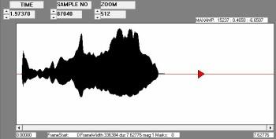
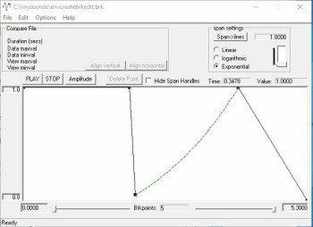
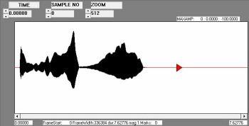

# Mingling Involving Envelopes

*by Dr Archer Endrich*

*Spectral and Amplitude Envelope Transfers*

| [Introduction to Mingling](#MINGLEOVERVIEW) | |
|---|---|
| [Key Processes](#MINGLEPROCESSES) | [Envelope Direct](#ENVDIRECT) |
| [Create an Envelope](#ENVCREATE) | [Extract & Impose](#ENVEXTRIMP) |
| [Reshape an Envelope](#ENVRESHAPE) | [Amplitude Envelope Crossover](#AMPCROSS) |
| [Spectral Envelope Crossover](#SPECAMPCROSS) | [Spectral Interpolation](#SPECROSS) |
| [Vocoding](#VOCODE) | [Transition Soundfiles](#SFTRANSITION) |

## Introduction to Mingling {#MINGLEOVERVIEW}

The CDP software has quite a few different ways to combine soundfiles other than by mixing. These are wonderful resources for intricately interweaving sound material. The examples here focus on envelopes and remain very simple, designed to make it easy to hear what is happening. Much more subtle interweavings are possible. Those involving manipulation of analysis windows are covered in [Mingling Involving Analysis Windows](mingling-involving-analysis-windows.md).

Working with envelopes often just means shaping the onset and decay amplitude transients of a sound. In CDP ENVEL DOVETAIL does this, with linear and exponential curve options. See [Basic Soundfile Editing](basic-soundfile-editing.md#DOVETAIL). However, the CDP software is more concerned with a variety of processes that combine specific features of soundfiles involving amplitude and spectral data.

As a quick overview, the CDP software has facilities for creating envelopes from scratch, for extracting either an amplitude or a spectral envelope from a sound and imposing it on another sound and for reshaping amplitude envelope data and for amplitude or spectral envelope crossovers. Envelope transfers are useful as a middle step of a morph, where this is appropriate. 'Vocoding' involves spectral envelopes, but is designed especially for vocal sounds because it extracts and imposes 'formants' (frequencies amplified by the vocal tract's resonance chambers) from one sound and imposes them on another. Although not directly involving envelopes, there is also a facility to mingle two soundfiles by creating a series of soundfiles that, as weighted mixes, could represent stages in a transition from one to the other.

## Minglings - Key Processes {#MINGLEPROCESSES}

The basic CDP mingle processes are illiustrated in this document. There are several more processes available in the ENVEL Group. The names given below are as in the Reference Documentation; TD = Time Domain, and SD = Spectral Domain). Exponential curves can be made by preceding the *level* value with an 'e'.

- ENVEL IMPOSE Mode 1 [TD] to extract the amplitude envelope from one soundfile and impose it directly onto another soundfile
- ENVEL CREATE [TD] to create your own envelope shape from scratch: Mode 1, create a binary .evl file), Mode 2: create a text breakpoint file (.brk)
- ENVEL EXTRACT Modes 1-2 [TD] to extract the amplitude envelope from a soundfile and save it as a binary envelope file (Mode 1, .evl extension) or as a text breakpoint file (Mode 2, .brk extension)
- ENVEL RESHAPE [TD] to choose among 15 algorithms for reshaping an existing envelope
- ENVEL IMPOSE Modes 2-4 [TD] to impose envelope files on a soundfile: Mode 2 (binary .evl), Mode 3 (text breakpoint .brk), Mode 4 (text breakpoint in dB .brk)
- SUBMIX CROSSFADE [TD] for a simple amplitude crossfade between two sounds: the first gets quieter as the second gets louder so that the sound moves smoothly from the first to the second
- SPECROSS PARTIALS [SD] to interpolate the partials of pitched sounds from one to the other, using analysis file data
- FORMANTS VOCODE [SD] to impose the spectral envelope of one sound onto another sound to make it 'speak' with its 'voice'
- SUBMIX INBETWEEN [TD] which will create a series of output soundfiles that capture different moments in the transition from one soundfile to another

## Envelope Direct {#ENVDIRECT}

**Envelope Direct** – [ENVEL IMPOSE]

The simplest and most direct way to extract an amplitude envelope from one sound and impose it on another sound is with ENVEL IMPOSE, Mode 1.

SL: `ENVELOPE -> impose -> env from another soundfile`
SSh: `Soundfile -> ENVELOPE -> impose -> impose using soundfile`

Note that two soundfile inputs need to be supplied: the first one is the sound from which the envelope is taken, and the second one is the sound onto which the envelope is imposed. As an example, the envelope of [stoneflg.wav](../sounds/stoneflg.wav) is imposed on the sound of a (French) horn [horn.wav](../sounds/horn.wav), producing [stonehorn.wav](../sounds/stonehorn.wav). Note that it is the second file in the list that is imposed on the first: the order of the inputs is important. Perhaps revise [How to Handle Two Inputs](how-to-handle-two-inputs.md).

## Create an Envelope {#ENVCREATE}

**Create an Envelope** – [ENVEL CREATE]

Users working in a hybrid environment will have high quality graphic tools for creating amplitude envelope shapes. In a CDP context, I find it easiest to listen to a sound, think about what I want to do to it, perhaps look at it in a graphic editor, such as CDP's VIEWSF, draw a sketch of *time amplitude* points on a 0 to 1 scale, and then write a text file in a text editor and load it in a GUI if using one. Windows users could use Richard Dobson's graphic *brkedit.exe* (set duration, amplitude scale and number of points). Exponential curves can be created by clicking on a segment and selecting 'exponential'; when saving, select 'save extended'.

SL: `ENVELOPE -> create -> textfile output`
SSh: `Soundfile -> ENVELOPE -> create -> breakpoint envelope`

The command line Usage shows that after the Mode the first parameter is your file and the second parameter is the file created by the program. Mode 2 was used for this example.

```
USAGE: envel create 1 envfile createfile  wsize
OR:    envel create 2 brkfile createfile

MODES..
1) creates a BINARY envelope file:
   If you specify starttime > 0,vals from 0 to starttime hold your startlevel.
2) creates a (TEXT) BRKPNT file:   File starts at time you specify.
```

To create a customised envelope file, write a text *createfile* with *time* [e]*level* data pairs. An 'e' can be used to specify an exponential curve. The *level* can be expressed on a 0 to 1 scale or in dB between -96dB and 0dB (add 'dB' after the value – use the appropriate Mode of the program).

'ADSR' is a familiar way to think about envelopes: Attack - Decay - Sustain - Release. The intention here is to create a simple ADSR envelope file and apply it to [horn.wav](../sounds/horn.wav), which looks like this in CDP's VIEWSF:



The customised envelope breakpoint file *envcreatemyfile.brk* looks like this (I've added explanatory comments, but they are not actually allowed in this file). It can be written in a text editor and opened/loaded in the ENV CREATE process page of the *Sound Loom* or *Soundshaper* GUI, or written *via* the text editor facility of the GUI.

```
0.0   1.0   ;Attack
1.97  1.0   ;Full amplitude held until 1l97, then Decay begins
2.1   0.05  ;Decay ends, Sustain begins
4.0  e1.0   ;Sustain (exponential) ends, Release begins
5.3   0.0   ;Release ends
```

This is the image that it creates, as realised in Richard Dobson's BRKEDIT program (PC).



This file, which puts a quick decay part way into the file and then an exponential amplitude increase over 1.9 seconds, is used as the input to ENVEL CREATE Mode 2 (breakpoint text file), naming the output file created by the program *envcreateprgfile.brk*. Note how it fills out the Sustain with an exponential curve (comments are added):

```
0.000000	1.000000   ;Attack
1.970000	1.000000   ;Full amplitude held until 1l97, then Decay begins
2.100000	0.050000   ;Decay ends, Sustain begins
2.218750	0.058525   ;Sustain (exponential) begins
2.337500	0.077699
2.456250	0.105186
2.575000	0.139996
2.693750	0.181513
2.812500	0.229299
2.931250	0.283016
3.050000	0.342397
3.168750	0.407217
3.287500	0.477287
3.406250	0.552443
3.525000	0.632543
3.643750	0.717457
3.762500	0.807072
3.881250	0.901285
4.000000	1.000000   ;Sustain ends, Release begins
5.300000	0.000000   ;Release ends
```

The sound now sounds like this: [hormenvd.wav"](../sounds/hornenvd.wav) and looks like this:



Note that ENV CREATE only writes an envelope file. ENVEL IMPOSE needs to be used (with the Mode appropriate for that file) actually to envelope a sound.

## Extract & Impose Amplitude Envelopes {#ENVEXTRIMP}

**Extract & Impose Amplitude Envelopes** – [ENVEL EXTRACT Modes 1-2 / ENVEL IMPOSE Modes 2-4]

This is a shape transfer mechanism whereby the amplitude envelope of one soundfile is extracted and imposed on another soundfile. These modes are for binary or text breakpoint envelope files. The envelope from EXTRACT is saved separately so that it can be used again, using IMPOSE to place it on some other soundfile, possibly with some reshaping as an intermediate process.

SL: `ENVELOPE->extract->binary output (.evl)`
SSh: `Soundfiles->Envelope->extract->.evl`

It is best to extract to an **.evl** filetype (SSh seems reluctant to use the **.brk** type). In *Soundshaper* for example, place the sound onto which you want to impose the envelope into grid cell 'A0', click on 'B0' and drag the **.evl** file to this cell OR open it via the `File` menu. Now summon ENVELOPE IMPOSE and click on grid cell 'B0' to add the **.evl** file as the second file. Thus [trcdtg.wav](../sounds/trcdtg.wav) and *contrenv.evl*, the binary envelope file extracted from [countr.wav](../sounds/countr.wav), to form [cntenvontotrcdtg.wav](../sounds/cntenvontotrcdtg.wav). The amplitude *shape* of the words (not the words themselves) are clearly heard in the tractor sound. This process can be used to create the middle step of a morph, as we shall describe below.

## Reshape an Envelope {#ENVRESHAPE}

**Reshape an Envelope** – [ENVEL WARP]

It may be useful at times to reshape an envelope before mingling. ENVEL WARP provides 15 ways to do this, applied directly to a soundfile. Sister programs apply the same functions to an existing breakpoint envelope file (ENVEL REPLOT] or to a binary envelope file [ENVEL RESHAPE], in which case the reshaped envelope would have to be IMPOSED on a soundfile before the mingling.

Mode 3, for example, offers to 'exaggerate' the envelope (range 0.01 to 100). There is an *exaggerate* parameter with a range > 0.0. If it is less than 1, low values of the envelope are boosted; if more than 1, high values are boosted. With [count.wav](../sounds/count.wav) as the source sound, when *exaggerate* is below 1, set at 0.05, the lower part of the sound is strengthened and we hear more of the noise components of the voice: [countexaglo.wav](../sounds/countexaglo.wav). When *exaggerate* is above 1, set at 4, we hear the top part of the voice with clean spaces inbetween: [countexaghi.wav](../sounds/countexaghi.wav). Each sound is going to respond differently to the *exaggerate* parameter, depending on the nature of its envelope. A 'lively' envelope will probably respond better.

Mode 11 'corrugates' the envelope. It takes as input a binary envelope, which is usually extracted from a soundfile. Assuming we have done this, producing *bellaeenv.evl* from [bellaedtbtob.wav](../sounds/bellaedtbtob.wav), this .evl is given to ENVEL RESHAPE Mode 11, naming *bellaeenvcorr.evl* as the *outfile*. Two parameters are also needed: the number of windows in the trough to set to zero and the number of windows between peaks. These were set to 3 and 6 respectively. The result, after imposing this new envelope back onto the original soundfile, does indeed sound 'corrugated': [belcorrg.wav](../sounds/belcorrg.wav). Any process that removes signal may need a bit of gain afterwards to make up for the loss. Belcorrg.wav was gained x 3 with MODIFY LOU8DNESS, Mode 1.

A sound like this could provide source material for other transformations. Timestretched 3 times and it is not unlike a sample-hold effect. Then lowered an octave with MODIFY SPEED, the tone is richer (and the file longer). This suggestion illustrates how sounds can be sculpted and developed by making the output of one process the input of another.

There are 13 more modes to explore in ENVEL WARP. The different versions of the ENVEL WARP program handle different envelope file data formats: REPLOT (breakpoint .brk envelope files) and RESHAPE (binary .evl envelope files), as noted above.

## Amplitude Crossover {#AMPCROSS}

**Amplitude Crossover** – [SUBMIX CROSSFADE]

SUBMIX CROSSFADE gradually reduces the amplitude of the first sound and while increasing that of the second sound. The source sound used for this example is balsam.wav. Because it is only 2 seconds in duration, I reversed it (balsmr.wav) and then joined 3 of these reversed versions with the original forwards version to form [balsamjoinr.wav](../sounds/balsamjoinr.wav) [SFEDIT JOIN]. This was then crossfaded with [count.wav](../sounds/count.wav) to make [balscountxfade.wav](../sounds/balscountxfade.wav)). We hear the count come in with a softly spoken 'two' (thereabouts) and sound ends with 'ten' spoken on its own (louder).

SL: `MIX->crossfade`
SSh: `Edit/Mix->MIX->Crossfade`

Load the two inputs (as above!) and run. You may want to revise [*How to Handle Two Inputs*](how-to-handle-two-inputs.md).

## Spectral Amplitude Crossover {#SPECAMPCROSS}

**Spectral Amplitude Crossover** – [COMBINE CROSS]

This Spectral Domain program produces a result very different from that of the amplitude crossover in the Time-Domain. Here the envelope is the *spectral* envelope, which is the amplitude of the component *frequencies*, the 'channel amplitudes', at any given time point: i.e., the changing pattern of the timbre/colour of the sound. With COMBINE CROSS

`SL: COMBINE->cross channels`
SSh: `Soundfiles->MORPH/FORMANTS->cross`)

*the spectral envelope of the second sound is imposed on the first*, so take care regarding the order in which you supply the sounds to the program. With trcdt.wav as the first file, and count.wav as the second, the envelope of the words is prominent and the speech is roughened by the tractor sound: [trcdtcountcc.wav](../sounds/trcdtcountcc.wav). With count.wav as the first file and trcdt.wav as the second, the steadier envelope of the tractor sound is prominent with the words just peeking through: [counttrcdtcc.wav](../sounds/counttrcdtcc.wav) – the results are quite different.

## Spectral Interpolation {#SPECROSS}

**Spectral Interpolation** – [SPECROSS PARTIALS]

SPECROSS PARTIALS interpolates the partials from one analysis file *for a pitched sound* onto those of another. The parameter list shows it to be a fairly complex program.

`specross partials analfile1 analfile2 outanalfile tuning minwin signois harmcnt lo hi thresh level interp [-a -p]`

It is an example of one of the more advanced CDP programs that takes a bit of exploratory work before it can be used effectively.

SL:
SSh:

Here is a sound produced by using (in analysis file format) [horn.wav](../sounds/horn.wav) as the first sound and [bellaedtbtob.wav](../sounds/bellaedtbtob.wav) as the second sound, resulting in: [horntobel09-03.wav](../sounds/horntobel09-03.wav). I'm not sure what to expect. There seems to be a somewhat serendipitous mingling of the partials. Perhaps this result occurred because my parameter values were rather generous.

The parameters were set as follows:

- *tuning* – 6: the range in semitones within which the harmonics are considered to be 'in tune', i.e., fairly wide (The default is 1)
- *minwin* – 50: minimum number of adjacent windows that must be pitched for a pitch-value to be registered (the default is 2)
- *signois* – 40: signal to noise ratio in decibels
- *harmcnt* – 4: midway in the 1 to 8 range (peaks which must be harmonics)
- *lo frq* – 65: lowest frq acceptable for a pitch (Default 9Hz)
- *hi frq* – 2000: highest frq acceptable for a pitch (Default nyquist/8 – nyquist is sample rate / 2)
- *thresh* – 0.2: minimum acceptable level for a partial (default 1.0)
- *level* – 1.0: level of output (Default 1.0)
- *interp* – *specrossinterp.txt* which contained 0.0 0.9, 5.0 0.3 (The range is 0 to 1)

The *theshold* parameter appears to be very important. It seems to relate to the degree of prominence of the partials in the second sound. The values used in my example compromise this prominence at the beginning (0.9) and gradually release it towards the end (0.3). Try it the other way round. It is possible to set parameter values in such a way that most of the frequencies are removed, making it impossible for the program to create an *outfile*. You don't see that that has happened until you get a message from PVPLAY (playing the analysis file on the command line) to that effect. The harmonicity of the inputs is also an issue, and perhaps bellaedtbtob.wav lacked firmly pitched content.

## Vocoding {#VOCODE}

**Vocoding** – [FORMANTS VOCODE]

The basic idea of 'vocoding' is to make one sound 'speak' with the voice of another. The 'vo-' in the name of the technique is a reference to 'vocal'. However, its use doesn't have to be restricted to this context. It takes two analysis files as inputs ('two inputs' procedure). Here we make counting to ten speak with the voice of a tractor.

- **Thus** trcdtgana.ana and countana.ana are the inputs. Parameters: *Formants by freq.*, *Channels* 1 (lower value is more accurate), *Low frq* 50 (the tractor is a low sound), *High frq* 10,000 and *Gain* 0.707 => trcdtvoccnt.ana, resynthesised to [trcdtvoccnt.wav](../sounds/trcdtvoccnt.wav). The result is reasonable, but could perhaps be cleaner by putting the amplitude envelope of the count onto the tractor.

- **So**, first extract the envelope from count.wav (=> countenv.evl) and then impose it on trcdtg.wav (=> [cntenvontotrcdtg.wav](../sounds/cntenvontotrcdtg.wav)) using ENVEL EXTRACT and ENVEL IMPOSE. Then analyse this result to get an analysis file input for vocoding: cntenvontotrcdtg.ana

- **Having** done this, reset for vocoding:

  SL: `FORMANTS->vocode`
  SSh: `Spectral->Morph/Formants->Vocode`

  with inputs cntenvontotrcdtg.ana and countana.ana (same parameters as above). This produces cntenvtrcdtgvoc.ana resynthesised to [cntenvtrcdtgvoc.wav](../sounds/cntenvtrcdtgvoc.wav).

## Soundfile Transitions {#SFTRANSITIONS}

**Soundfile Transitions** – [SUBMIX INBETWEEN]

Rather than produce a transition that occurs within a single output soundfile, SUBMIX INBETWEEN takes two soundfile inputs and generates *a series of soundfiles* that capture gradually changing (weighted) mixes that start with mostly the first sound and end with mostly the last sound. The number of soundfiles produced is specified either by the *count* parameter (Mode 1) or by the number of ratios in the ratios textfile (Mode 2). The file can contain any weighting pattern, not just a smooth transition as in Mode 1. The user supplies a generic *outfile* name, to which '001', '002' etc. are appended.

While SUBMIX MIXTWO mixes two soundfiles with an equal balance between them, SUBMIX INBETWEEN creates a series of soundfiles mixed with varied balances. In Mode 1, the balance automatically shifts from *infile1* to *infile2* across *count* number of soundfiles produced. In Mode 2, a textfile of ratios between 0 and 1 specifies the balance point, one ratio for each soundfile produced: 5 ratios produce 5 soundfiles. A ratio of 0 means that *infile1* is silent and *infile2* is audible at full volume. A ratio of 1 produces the opposite result.

SUBMIX INBETWEEN is useful for at least two reasons.

1. It is a quick way to test a variety of balance points in a mix of two soundfiles. The composer may want to repeat a mixed soundfile several times in a composition , each time changing the weighting.

2. Alternatively, the aim may be to find a particular weighted mix of two soundfiles for use as new source material. This is a quick way to test a variety of balance points and find the desired balance.

The ratios textfile contains a list of decimals between 0 and 1. The ratios are in fact gain factors, so can be expressed as decimals between > 0 and 1. There must be an even number of ratios in the file.

As an example, the sound [wabe005.wav](../sounds/wabe005.wav) mixes [wavesdt.wav](../sounds/wavesdt.wav) and [bellaedtbtob10s.wav](../sounds/bellaedtbtob10s.wav) using the ratio 0.9. Thus the first sound is used as a soft background for the second sound. The ratios file *waberatios.txt* was simply `0.1  0.3  0.5  0.7  0.9`, so the 0.9 ratio will be the 5th file. Notice that there are no times: it is not a breakpoint file. 4 more soundfiles were produced by the same run of the program. The sequence starts with the ratio set at 0.1, so the waves file dominates, etc.

[**RETURN**](index.md#TOPIC4) to A Learning Manual for CDP, Topic 4

---

Last updated: 19 September 2021
