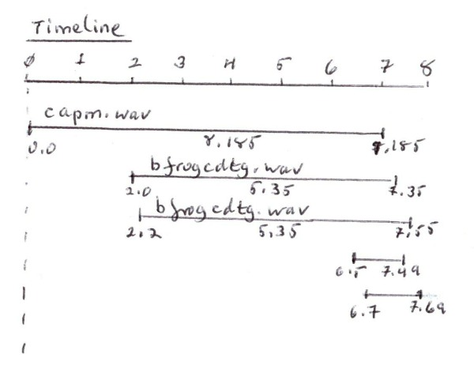

# Mix Concepts and Planning

*by Dr Archer Endrich*

*assembling a passage of music by mixing*

| [About Mixing](#ASSEMBLY) | [Planning a Mix](#PLANNING) |
|---|---|

'Mixing' is a key step in assembling a group of sounds. Levels are crucial, and are constantly being adjusted in the studio to get the right 'balance'. The same is true of spatial placement. Even if all the positions are fixed rather than moving, it is still important to place the sounds so that they are effectively spread/placed between/among the speakers so that the desired clarity, fusions and ambience are achieved.

**Concepts –** {#CONCEPTS} There are two ways to think about mixing:

- **vertical:** all the sounds are at or very close to the same start time, and
- **horizontal:** the sounds are spread out in time, whether separate or overlapping, to make 'sequences' of sounds)

**Vertical mixing** is a way to build sound complexes out of a number of source sounds. The CDP software can handle 50 or more in a single mix – though avoiding overload with such a mix would be problematic! It is like 'colouring' a sound with the qualities of another sound, and the result is often meant to be heard as a single new sonic entity. CDP makes it possible to do this in the mixfile without having to place the sounds on separate tracks. A companion facility is SUBMIX SYNCATTACK which can create very strong sounds from a list of sounds by synchronising the peaks of their attack transients, a technique that Trevor Wishart has used to good effect in *Imago*.

**Horizontal mixing** is where the emphasis is on the sequence of sounds, whether placed separately in time or overlapping. The graphic facilities of many 'sequencer' packages handle this very well by making it easily visual. The CDP software does not contain this kind of visual facility, relying rather on a text file containg soundfilename, start time, number of channels, level and (fixed) pan positioning. This is the standard CDP mixfile format for stereo outfiles, and any moving pan has to be applied to the sounds prior to mixing. If working in this way, it is useful to sketch out a mix on paper, showing soundfile durations, start points and areas of overlap, as discussed below.

However, CDP also has extensive facilities for multi-channel mixing, simply applied by placing a colon between start and end destinations in the channels parameter (e.g., 2:6). Pan movement between these channels (i.e. speaker placements) results. There are other higher level facilities for multi-channel effects.

While these options can be mapped out and achieved via a CDP mixfile, many composers like to import their CDP-honed sounds into a sequencer package and use its graphic facilities. Another possibility closer to home, as it were, is Rajmil Fischman's AL/ERWIN which provides powerful mixing facilties combined with some algorithmic processes in a graphic environment. This is available for download from **https://www.keele.ac.uk/music/people/rajmilfischman/rajmilfischmanfreesoftware/** or from the CDP Website Downloads page.

## Planning a Mix {#PLANNING}

**Planning a Mix –** Planning a mix in CDP starts with knowing the number of **channels**, the **level** (*maxsamp*) and **duration** (*sflen*) of each component sound. These can be found in various ways, depending on your working environment. One way to plan a mix is to draw out a horizontal line with regular time intervals marked. Then draw lines for the sounds to be mixed (each annotated with their level and duration) below the main horizontal line and to their correct length on the timeline. As you draw in the lines for the soundfiles you see gaps or overlaps. If your diagram shows several sounds overlapping, it may be necessary to adjust their levels in the mix (downward) to avoid overload. Then put the mix together with one of the GUIs, or directly *via* a textfile.

Unless working in a multi-channel context (> stereo), moving pan needs to be applied beforehand. The pan placement in the mix needs to accommodate any movement already in a component sound – while considering the overall spread of all the sounds across the horizontal space between the speakers.

Here is a rough drawing illustrating such a sketch, showing the timing, horizontal lines and overlaps. This diagram is deliberately left in its original handwritten state to show that a bit of rough sketching with paper & pen or pencil can be a useful part of the process.



The corresponding text mixfile is *simplemix.mix*:

```
name           time  chans  level  pan
capm.wav       0.0   1      0.5    C
bfrogcdtg.wav  2.0   1      1.0   -1
bfrogcdtg.wav  2.25  1      1.0    1
clashmx.wav    6.5   1      1.0   -0.5
clashmx.wav    6.7   1      1.0    0.5
```

Having made such a drawing it can be a good idea to look at it and 'listen' to the mix unfold in your mind's ear at tempo for its full duration. This prepares you to hear the actual result with your musical expectations active rather than listening to the [result of the mix](../sounds/simplemix.wav) too passively. More adjustments will often be made as a result, usually by editing the mixfile, and the exercise is a preparation for hearing the mix in real-life for the first time: what it sounds like can be compared with your pre-imagined result.

The sketch and accompanying text mixfile show what is happening in any mix, behind the scenes, as it were. The procedure of writing the mixfile is straightforward enough, though there are tools in the GUIs which can facilitate the process. Mixing in *Sound Loom* and *Soundshaper* is described in detail in the *Create a Mix ...* documents reference in Topic 2, and there remains the hybrid option to do your mixing in a fully graphic DAW package.

Chapter 12 ('The Art of Mixing') in Curtis Roads' book *Composing Electronic Music* is just about the best survey of the musical issues involved in mixing I've come across.

[**RETURN**](index.md#TOPIC3) to A Learning Manual for CDP, Topic 3

---

Last updated: 25 August 2022
