  

**HITHER GATE MUSIC** | **Archer (Tom) Endrich** | **Composers' Desktop Project**

# Workshop on How to Compose with CDP TEXTURE

## by Archer Endrich

+:----------------------------:+:-----------------------:+:------------------------:+
| **Part I -- Information & Observations\                                           |
| [Pieces of the Jigsaw:](#JIGSAW)** **[source sound,](#SRC) [note data             |
| file,](#NDF) [parameters,](#PARAMS) [breakpoints](#BP)**                          |
+------------------------------+-------------------------+--------------------------+
| [**Musical                   | [**Visualising the      | [**A Useful              |
| Possibilities**](#MUSIC)     | Outcome**](#VISUAL)     | Toolbox**](#TOOLBOX)     |
+------------------------------+-------------------------+--------------------------+
| [**Group                     | [**Rhythms Old &        | [**Subtle                |
| Formations**](#GROUPS)       | New**](#RHYTHMS)        | Differences**](#SUBTLE)  |
+------------------------------+-------------------------+--------------------------+
| [**Designing                 | [**Designing            | [**Designing             |
| Decorations**](#DECORATIONS) | Motifs**](#MOTIFS)      | Ornaments**](#ORNAMENTS) |
+------------------------------+-------------------------+--------------------------+
| [**Combining Multi-Events &  | [**Combining Multi-Events, Harmony, Motifs &       |
| Rhythms**](#RHYTHMTEX)       | Rhythm**](#COMBOTEX)                               |
+------------------------------+----------------------------------------------------+
| **Part II -- [Focused Examples](#PARTII)**                                        |
+------------------------------+-------------------------+--------------------------+
| [**1. One                    | [**2. Pitch             | [**3. Harmonic           |
| Pitch**](#SECTION1)          | Range**](#SECTION2)     | Set**](#SECTION3)        |
+------------------------------+-------------------------+--------------------------+
| [**4.                        | [**5. Decorations & Ornaments**](#SECTION5)        |
| Time-Varying**](#SECTION4)   |                                                    |
+------------------------------+----------------------------------------------------+
| **[Play](txwsplay-MAC.htm) all Sound Examples -- & links to Play Lists with       |
| Parameter Data**                                                                  |
+-----------------------------------------------------------------------------------+

: Topics

> > ### *This workshop summarises key information and practical observations about using the CDP TEXTURE software created by the amazing Trevor Wishart, gleaned from my 3+ years of documenting and composing with TEXTURE. I then work through a stepped series of examples focused on specific TEXTURE facilities, aiming to give you an understanding of the software and the ability to use it to advantage in a variety of compositional projects.*
> >
> > ### *On using the CD-ROM and Installing the Texture Workshop on your hard disk, see the* Readme.txt.
> >
> > ### *Use the PC version to play the examples supplied (.wav). Use this file to play examples when you have remade them with the MAC batch files (.sh), which makes .aiff soundfiles.*

# Part I -- Information & Observations {#part-i-information-observations}

## [Summary of Musical Possibilities]{#MUSIC}

> Texture in music is a big subject! In this introductory section, we
> will focus on the compositional issues: what 'texture' is, what
> forms it takes, how our new computer-based tools open out new
> possibilities.
>
> **1.** **Texture** is a rather general reference to constructional
> types -- not so much musical forms as the overall layout of vertical
> and horizontal components. A short list of some familiar types will
> help to illustrate what is meant:
>
> - **monody** -- a single unaccompanied linear form
> - **polyphony (Renaissance)** -- layers of free-flowing melodic lines
> - **fugato & stretto** -- short (overlapping) repetitions of a melodic
>   motif with varying degrees of density
> - **bridge passage** -- a motivic patchwork forming interludes or
>   transitions between statements of thematic material
> - **canon** -- overlapping repetition of a long melodic line
> - **fugue** -- complex of thematic statements, countersubjects and
>   bridge passages
> - **homophony** -- melodic line accompanied by chords, with or without
>   movement in the inner 'parts'
> - **heterophony** -- several slightly different versions of the same
>   melody performed simultaneously
> - **layers of rhythmic motives** -- separate parts are each formed by
>   repetitions of rhythmic motives and layered together to form the
>   whole
>
> The keywords are then: **line** (i.e., **melody** or **tune**),
> **figures** (**motifs**, **embellishments**, **ornaments**),
> **density**, **overlapping**, **layers**, **patchwork**, **chords**
> (**harmonies**, **harmonic fields**).
>
> Motifs/embellishments/ornaments attached to or embedded in a melody (a
> 'tune') can be using the melody mainly as an *outline to be filled
> in* -- a familiar aspect of some forms of variation technique. I like
> to think of the notes of such an outline as **nodes** -- an underlying
> structure of nodes: a **nodal substructure** -- to which other
> elements are attached. This concept provides a way of clarifying the
> relationship of melodic components and can help in the generation of
> linear structures. This is relevant to the TEXTURE programs, which
> also attach 'motifs' and 'ornaments' to 'lines' (or to Harmonic
> Fields/Sets, or to random pitch selections).
>
> I personally prefer the term 'nodal substructure' because both the
> concept and application are somewhat abstract: in the manner of a
> steel framework rather than the finished surface of a building. Thus a
> pattern of nodes may have some 'tuneful' qualities, but often is not
> really a 'melody' or a 'tune', which are quite special linear
> forms. Trevor uses the term 'line'. The nodes are where other
> components are attached.
>
> **A texture is made up of multiple events, often with some form of
> repetition, similarities, &/or transformations, as well as a mix (or
> 'collage') of ingredients and an overall constructional pattern
> which may give it a sense of visual shape and/or dramatic gesture.**
>
> **2.** We can take another step in our understanding of 'texture'
> and its musical possibilities by considering its use in the music of
> the 20^th^ century.
>
> One way to start is to remind ourselves of the many textures with
> which we are familiar, sonic textures from Nature, human life and
> machinery. Textures such as the sound of: wind through leaves, waves,
> rain, the spring 'frog' chorus, the dawn chorus, groups of human
> voices speaking, shouting or singing, many feet walking, airplanes,
> traffic, motors, insects, factories, the battlefield, mixtures of all
> of these, etc., etc.
>
> Thus, just as 'collage' has been used in contemporary visual art to
> capture the myriad components of life today, so collages of sounds and
> sonic textures generally have been used by musicians for the same
> reason. In music, textures are achieved by using voices, pitch
> complexes, sound samples and effects, and mixes of all of these to
> form 'soundscapes' of every description. From seminal works such as
> those of the Futurists and composers such as Stockhausen (e.g.,
> *Momente*), to improvised or freely-notated sonic environments, we are
> in fact now very familiar with the presence of sonic textures in the
> musical forms or our time.
>
> **3.** It has been a natural development, therefore, for computer
> systems to assist in the creation of sonic textures. Hardware and
> software 'samplers' have been important tools in this regard. CDP
> itself began in 1986 as a direct-to-disk system to avoid the limited
> RAM capacity of the first hardware samplers, and so the idea of sonic
> texture and soundscape has been a part of CDP from the first. CDP's
> powerful set of sound transformation tools have been designed to help
> 'develop' the sound material and integrate it into musical forms.
>
> If the goal is to realise texture types with every pitch and timing
> fully-defined, then the composer can write the music out using
> standard notations, or make use of a sequencer &/or mixer (hardware or
> software). But to introduce the flexibility of random selection
> (within user-defined constraints) *as well as* fully defined chords or
> melodic components, and to mix and balance the relative presence of
> each of these in a musical texture, software of quite a different
> nature is required.
>
> One solution is to make use of software for algorithmic composition.
> This requires considerable expertise in programming but is ultimately
> the most powerful approach that can be used. Trevor Wishart's CDP
> TEXTURE Program Set establishes a middle ground between conventional
> sequencer and algorithmic software. It rings the changes on
> combinations of different musical features by means of a set of
> pre-established algorithms. You can choose among the components,
> design some of them fully and set up constraints for random selections
> for others. The textures can therefore contain aspects of conventional
> notation, proportional (space = time) notation, and graphic-gestural
> shapes -- the whole complex of computer-generated events is in fact
> best comprehended by the ear rather than the eye.
>
> **Thus the CDP Texture Set provides powerful semi-algorithmic tools
> with which to realise a variety of ordinary and extraordinary musical
> situations. Besides its ability to constrain multi-events to a
> pre-defined harmonic lattice, perhaps its most important musical
> feature is the ability to mix the random and the defined.**
>
> **4.** How can the computer help? While it is useful to bear in mind
> the standard texture constructs first listed, it is important to
> realise how the computer can make the realisation of textural
> configurations considerably freer, *by balancing computer selection
> (random choices constrained within \[time-varying\] user-defined
> limits) and fully user-defined components*. Thus the CDP Texture Set
> can for example randomise (within user-defined limits):
>
> - the pitch content and contour of figures (which pitches, the number
>   of note-events, the \[time-varying\] range of pitches used)
> - selection from a list of figures
> - selection from a list of input sounds
> - loudness, spatial placement and note-event duration
> - note-event timing density
>
> **5.** Thus with the CDP Texture Set, you can, for example (the list
> cannot possibly be complete!):
>
> - create contoured figures and extended passages with constrained
>   randomised content (pitch, loudness, spatial position, number of
>   note-events, tempo \...)
> - create fully defined motivic figures
> - define chords and 'snap' or warp all note-events to their pitches
> - create multi-event textures with pitches constrained within upper
>   and lower time-varying pitch contours (shapes)
> - create a horizontal 'line' (melody) of set pitches at set times,
>   and then attach a figure to them
> - create a rhythmic template and fill it with pitches which may or may
>   not be constrained to a chord (harmonic field/set)
> - select at random from a list of soundfiles (to mix them up in a
>   sonic collage)
> - select at random from a list of figures (changing order of
>   occurence, often creating overlaps)
> - create grouped note-events and set the (time-varying) time density
>   between them
> - create grouped note-events and attach them to a (timed) 'line'
>   (nodal substructure)
> - create melodies or arpeggios that are canonic, i.e., they overlap,
>   starting on the same or on different pitches
> - play with the tempo of figures and play them off against the (fixed)
>   timing of a nodal substructure (i.e., the start times and pitch
>   locations for the figures)
>
> The Workshop will focus on 20 specific texture configurations in order
> to show how the software operates in a step-by-step manner, for these
> are the tools with which to realise the above list of possibilities,
> as well as many more which only you can dream up.
>
> **6. Sounds!** There is another vitally important factor. The full
> potential of these semi-algorithmic mechanisms is realised when they
> are used as a design-framework on which to attach specially formed
> sounds, sounds transformed in order to take advantage of a specific
> framework shape. Our [21^st^ example](#EXAMPLE21) illustrates how, in
> a sense, new sounds are created by texturing compatible inputs.
>
> You could also try running Example 20 using
> [**whirrdtgd.aiff**](whirrdtgd.aiff), which is provided with the
> Workshop. It is a transformed version of marimba.aiff:
>
> - PVOC ANAL 1 marimba.aiff yourfilename.ana
> - STRETCH TIME × 3
> - SPEC CUT 0 to 1.1 sec.
> - STRETCH TIME × 3 on previous output
> - SPEC CUT again 0 to 1.1 sec.
> - STRETCH SPECTRUM 'above' 20 Hz, × 9, *exponent* = 0.6, *depth* = 1
> - PVOC SYNTH to resynthesise to make **whirr.aiff**
> - ENVEL DOVETAIL *fade in* = 0.2 with *in type* = 0 (linear), *fade
>   out* = 0.3, with *out type* = 1 (exponential)
> - Then reduce the level by 0.75 to avoid overloading when forming
>   textures. (The 'dtgd' in the final filename is a reminder that
>   these last two processes have been done: 'DoveTailGainDown').
>
> The result gives some limited insight into how the TEXTURE components
> can be designed to combine with a certain sound in order to derive new
> and different sonic complexes, or *v.vs.* When the sound is relatively
> unpitched in nature, pitch structures can be used to shape the result
> without pitch itself becoming too prominent. When the sound has a fair
> degree of pitch content, as does **whirrdtgd.aiff**, you have to be
> careful about the use of pitch, as too much of it can make the result
> sound unnatural or trivial. You can see what I mean by trying it with
> some of the other Examples in the Workshop -- but perhaps what one
> feels about the balance of 'sound' and 'pitch' is really a matter
> of personal preferences and taste.
>
> The examples for the workshop remain somewhat more prosaic partly in
> order to illustrate the operation of the software with sufficient
> audible clarity, and partly to show how far one can go with pitch
> design with the TEXTURE software. **But please bear in mind that the
> fun begins, as it were, when transformed sounds are matched to texture
> design-frameworks.**

## [Pieces of the Jigsaw]{#JIGSAW}

> The TEXTURE Set is so rich and diverse that it is like a big jigsaw
> puzzle. There are many different components to use and fit together.
> These are the main pieces of the puzzle:
>
> - [**the source sound --**]{#SRC}
>   - This needs to be selected and adapted to suit the sonic idea for
>     the texture.
>   - The program always reads from the *beginning* of the source to the
>     length specified, which can be its entire length; this is a very
>     important consideration, and distinguishes TEXTURE from
>     *GrainMill*.
>   - More than one sound can be used, to produce a random mix.
>   - A time-varying list of sounds can be used, so that the texture
>     cycles selects different sources at specified times.
>
>
>
> - [**the note data file --**]{#NDF}
>   - [**Note Data File Chart**](ndfchart.htm) summarises the structure
>     of the note data file for each of the 14 programs in the Texture
>     set.
>
>
>   - The table below shows the format of the various components of the
>     note data file, but not their order or combinations. It summarises
>     the technical detail involved in writing the various component
>     parts of the note data file. (This and the next table have also
>     been placed in [**txcharts.htm**](txcharts.htm) which can be
>     printed as another handy reference sheet.)
>
>     +-------------+--------------------------------+------------------+----------------------+------------------+
>     | MPV         | HF-S                           | Line (NS)        | Motif/Ornament       | Timing           |
>     +:===========:+:==============================:+:================:+:====================:+:================:+
>     |     60      |                                |                  |                      |                  |
>     |             |     #4 (M 1-3)    #4 (M 2-4)   |     #4           |     #4               |     #4           |
>     |             |     0 1 60 0 0    0.0 1 60 0 0 |     0.0 1 60 0 0 |     0.00 1 60 85 0.3 |     0.00 1 0 0 0 |
>     |             |     0 1 65 0 0 OR 1.5 1 65 0 0 |     1.0 1 65 0 0 |     0.25 1 65 65 0.3 |     0.34 1 0 0 0 |
>     |             |     0 1 67 0 0    2.0 1 67 0 0 |     2.5 1 67 0 0 |     0.50 1 67 75 0.3 |     0.67 1 0 0 0 |
>     |             |     0 1 72 0 0    2.0 1 72 0 0 |     3.5 1 72 0 0 |     0.75 1 72 55 0.3 |     1.00 1 0 0 0 |
>     |             |     N N Y  N N    Y   N Y  N N |     Y   N Y  N N |     Y    N Y  Y  Y   |     Y    N N N N |
>     |             |                                |                  |                      |                  |
>     +-------------+--------------------------------+------------------+----------------------+------------------+
>
>     : **Illustrating the Format of Note Data File Components**
>     The 5 fields are: Times, Instr_no, MPV, Vel, Dur
>     ('Y' and 'N' refer to Active and Inactive Fields
>     -- they are *not* part of the file --
>     the '1' for *instrument_number* must always be present, although
>     inactive) {border="1" cellpadding="1" bgcolor="#6495ED"}
>
>
>
>   - This next table summarises which CDP Texture program uses which of
>     the above components. **Studying this table is one of the keys to
>     grasping which program to use to achieve various possible musical
>     results.** It complements the full [**Note Data File
>     Chart**](ndfchart.htm) .
>       --------------------------------------------------------------------------------
>       Program             MPV       Timing     Line (NS)     HF-S      Motif/Ornament
>       --------------- ----------- ----------- ----------- ----------- ----------------
>       **SIMPLE**          MPV          \           \         HF-S
>
>       **GROUPED**         MPV          \           \         HF-S
>
>       **DECORATED**       MPV          \         Line        HF-S
>
>       **MOTIFS**          MPV          \           \           \            M/O
>
>       **MOTIFSIN**        MPV          \           \         HF-S           M/O
>
>       **ORNATE**          MPV          \         Line        HF-S           M/O
>
>       **TIMED**           MPV        Times         \         HF-S
>
>       **TGROUPED**        MPV        Times         \         HF-S
>
>       **TMOTIFS**         MPV        Times         \           \            M/O
>
>       **TMOTIFSIN**       MPV        Times         \         HF-S           M/O
>       --------------------------------------------------------------------------------
>
>       : **Note Data File Components Used by Each Function**
>       {border="1" cellpadding="4" bgcolor="#6495ED"}
>
>
>
>   - First the real or arbitrary **Midi Pitch Value** (MPV) of the
>     source sound is given. All transpositions are made with reference
>     to this value. If the input is a pitched sound and the MPV
>     indicates a different pitch, then the sound will be transposed by
>     the difference even when no other transposition is specified.
>     These transpositions are in the 'time-domain', meaning that an
>     upward transposition makes the sound higher and faster, and a
>     downward transposition makes the sound lower and slower. The MPV
>     is mandatory.
>
>
>   - *The next parts of the note data file are optional and vary from
>     program to program, depending on what the program does, as in the
>     above table.*
>
>
>   - A **Harmonic Field or Set** can be defined.
>     - The 'field' reproduces the defined pitches in all octaves of
>       the parameter pitch range. The 'field' modes are **1** (all at
>       the same time) and **2** (changing times).
>     - The 'set' reproduces only the defined pitches. The 'set'
>       modes are **3** (all at the same time) and **4** (changing
>       times).
>     - When no field or set is defined, the program selects pitches at
>       random from within the range set by the parameters. This is Mode
>       **5** ('None').
>
>
>
>     Pitches can only be specified as MIDI pitch values, but these may
>     be fractional to achieve microtonal tunings. (SNDINFO UNITS Mode 2
>     will convert any frequency value to its MIDI equivalent -- you can
>     use the Music Calculator in *Sound Loom*.) A list of note names
>     and their MIDI Pitch Values (and Csound values) is given in the
>     [**Equivalent Pitch Notations Chart**](notechrt.htm). A special
>     version has been designed to print onto 2 sides of A-4:
>     [**notechpr.htm**](notechpr.htm).
>
>
>   - The format of **lines** ('nodal substructure') involving pitch
>     is always the same, but not all fields are active in every case.
>     The form is '0 1 60 0 0': *starttime, instrument, MPV, velocity,
>     duration*. *Starttime* and *MPV* are always active, *velocity* and
>     *duration* sometimes. ***Instrument* is not implemented and is
>     always 1 (it may not be omitted).**
>
>
>   - The DECOR and ORNATE programs make use of a 'line', which I tend
>     to think of as a 'nodal substructure' because figures are built
>     on them. *Starttime* and *MPV* are active, thereby creating a
>     timed linear macro structure. Thus you would normally plan longer
>     durations for the nodal substructure, fitting the faster moving
>     motifs or ornaments onto it. However, the motifs or ornaments may
>     overlap nodal points.
>
>
>   - **Motifs and Ornaments** are fully defined, with *starttime, MPV,
>     velocity* and *duration* active. This makes it possible to create
>     conventional melodic figures.
>
>
>   - Finally, there may also be **rhythmic templates**. These are used
>     in the 'timed' programs (TIMED, TGROUPED, TMOTIFS and
>     TMOTIFSIN). The rhythmic templates create a rhythmic master
>     pattern for individual random pitches, for pitches drawn from a
>     defined harmony, or for fully defined motifs.
>
>
>
> - [**key shaping parameters --**]{#PARAMS}
>   - ***packing*** -- time-density of note events or timing of the
>     onset of grouped events;
>   - ***skiptime*** -- time *between* repeats of the whole 'line'
>     (nodal substructure) or rhythmic template. ***Skiptime* begins at
>     the start of the last 'line' substructure node or rhythmic
>     template time point and bridges the time until the next repeat of
>     the line or rhythmic template.** This bridge will cause:
>     1.  an overlap with the last note-event of the line or template if
>         a value very close to zero is given (0 itself is not allowed)
>     2.  the repeat to begin 'on the beat' if the value equals the
>         time from the onset of the last note-event of the line or
>         template to the start of the next 'beat' of the music. E.g.,
>         a template arranged in 1 second 'beats' which ends at 1.75:
>         a *skiptime* of 0.25 will cause the next repeat to begin at
>         2.0.
>     3.  a gap if *skiptime* is longer than the last note-event (or
>         motif which begins on that time point).
>
>     The length of the note-event or motif on this last node or
>     rhythmic template time point needs, therefore, to be taken into
>     account.
>   - ***scatter*** -- temporal offset of each *packing* value
>   - ***tgrid*** -- given in milliseconds, this snaps motifs to a
>     regular timing grid.
>   - ***sounds*** -- if first and last are the same, one source sound
>     is used; if different, more than one will be used, selected at
>     random; if time-varying, the source at the given time will be
>     selected, the numbers following the order of the input filenames.
>   - ***gain*** -- low and high loudness given as MIDI velocity values
>     (0 to 127). Motifs and ornaments can have the loudness of each
>     note defined, which is very important in order to make specific
>     rhythmic patterns audible -- otherwise all the notes run together
>     and the pattern can't be heard.
>   - ***duration*** -- the amount (length from the start) of the source
>     sound to use for each note event. Use of the entire length of the
>     source may be selected.
>   - ***use whole sound \[-w\]*** -- this option needs to be selected
>     in order to use the entire length of the input soundfile for each
>     note event of the texture. It greatly affects the overall result!
>     Many effects cannot be achieved without this, but the input sound
>     has to be prepared with the end in mind.
>   - ***pitch*** -- low and high values for the pitch range within
>     which the multi-event texture will be constructed.
>   - ***atten*** -- overall gain control of the output. Gain may need
>     to be reduced when the packing is very high and the input sound
>     has a good signal.
>   - ***mult*** -- this controls tempo. 1 for no change, \<1 for
>     faster, \>1 for slower. 60 divided by the desired tempo gives the
>     appropriate value for *mult*. E.g., 60 divided by crotchet=50 =
>     1.2.
>   - ***position*** -- spatial placement of the output. A time-varying
>     file can produce panning.
>   - ***spread*** -- this is the size of the horizontal pan field. 1 is
>     full spread.
>   - ***seed*** -- the default is 0, for a different result when the
>     program is run again. The same (non-zero) seed number produces the
>     same result.
>   - Similar parameters handle the packing, pitch range and spatial
>     spread of 'groups'. **Note that when a harmonic field or set is
>     being employed, the pitch range controls the *number of notes of
>     the field* that will be used.** *Phgrid* handles quantisation
>     within groups.
> - [**time-varying data --**]{#BP}
>   - The use of breakpoint files to achieve time-varying data is a
>     great way to achieve supple and 'musical' results.
>   - Most parameters allow the use of breakpoint files, whether a
>     single parameter or parameters with both upper and lower range
>     limits.
>   - An upper limit may be time-varying while the lower limit is a
>     constant, or *v.vs.* or both may be time-varying.
>   - Entering breakpoint files can be fast if you first put in the
>     times, then tabs or spaces after each time, and then the values.
>   - It is often useful to draw a rough diagram of the result you want
>     to achieve, mark time points when the drawn changes should occur,
>     and write times and values in two rows underneath. You can then
>     use this diagram as a reference when you type in your breakpoint
>     file.

## [Visualising the Outcome]{#VISUAL}

> The Texture Set lends itself to **visual imagery**. The multiplicity
> of parameters means that this must often be fairly abstract and
> diagrammatic, but nevertheless there is considerable scope for using
> the visual imagination. In particular, applying time-varying upper and
> lower pitch limits automatically results in a visual image.
> 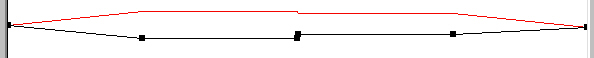 (These are the time-varying
> upper and lower pitch contours for Example 13.) Adding dots for
> changing note-event densities, inserting staves with (changing)
> chords, and using a center-right-left zig-zag for spatial movement,
> and you can begin to see how an image can be assembled.
>
> Another factor is how the sonic character of the input sound is
> portrayed. Here we need to activate our **aural imaginations**. As we
> imagine the sound (or actually listen to the \[transformed\] source)
> we will get some kind of visual image based on its pitch trace, tonal
> qualities, volume and surface texture.
>
> We can then superimpose the sonic image of the source onto the
> multi-event texture diagram and imagine the aural result when the
> source sound is spread, compacted, harmonised, panned etc. according
> to the shape(s) in the diagram.
>
> - When the desired sonic image result begins to become clearer to us,
>   we may want to adjust (transform) the source so that it contributes
>   more directly to the overall result. We may need a rougher sound, a
>   shorter or longer decay time, a more 'harmonious' sonority, a
>   muffled effect, inner detail (such as attack) brought out by
>   time-stretch, the spectrum shifted high (or glissing) or folded into
>   itself, granulation or vibrato \... -- with the full range of the
>   CDP sound transformation tools at our disposal.
> - On the other hand, we may need to revise our design strategies
>   within Texture in order to achieve just the right sonic image. So we
>   find ourselves tweaking density ('packing'), creating breakpoint
>   files for both upper and lower pitch ranges which will cause
>   harmonic sets to be revealed gradually or note events to move
>   contrapuntally, introducing changing chords in the note data file,
>   etc.
>
> Taking the time to activate the visual and aural imaginations and to
> see and listen internally would seem, therefore, to be an unusually
> appropriate activity when working with Texture.

## [A Useful Toolbox]{#TOOLBOX}

> A number of supplementary tools can facilitate using the Texture Set.
> If these are charts included with the CDP HTML reference
> documentation, it is recommended that you print them out and have them
> laminated so that they will be readily available and easy to handle.
> Some of the other tools mentioned are suggestions regarding an
> effective working method. The Texture Set is complex: experience shows
> that it is easy to lose the thread, and to come back to work which is
> ambiguous (you can't identify which parameter values gave which
> result).
>
> - [Chart of Equivalent Pitch Notations](notechrt.htm) -- This provides
>   a listing of MIDI Pitch Values for 11 octaves and their
>   (equal-tempered) frequency and *Csound* equivalents. If you wanted
>   to work in a different temperament, you could edit this chart to
>   create your own, substituting different frequencies and their
>   (fractional) MIDI values, as found with SNDINFO UNITS (or the Music
>   Calculator in *Sound Loom*.
> - [Note Data File Chart](ndfchart.htm) -- This summarises the changing
>   structure for the note data chart as required by the different
>   programs.
> - **Starttime patterns for different rhythmic figures** -- It will
>   save you a lot of time to have a starttime listing for your
>   favourite rhythms, especially if these involve more complex
>   features, such as acceleration and deceleration. I would recommend
>   that these all be done for crotchet = 60 = 1 second. This keeps the
>   durations fairly simple, and then the tempo can be adjusted. The
>   motifs and ornaments are essentially defined by their (ascending)
>   starttimes. The duration field results in gaps or overlaps depending
>   on the relationship between the duration and the proximity of the
>   starttimes. (See [Rhythms Old and New](#RHYTHMS) below.)
> - **Name codes** -- I would strongly recommend devising generic or
>   code names for a given texture that you are creating, so that all
>   the component files (note data file, breakpoint files, output
>   soundfile) *begin* with the same characters. You can then easily see
>   all the components for the texture when you look at the list of
>   files on your hard disk or backup floppies.
> - **Parameter list templates** -- you might like to create a form with
>   the Texture parameter names in a vertical column, and columns to the
>   right of this for values and breakpoint files. This gives a
>   time-saving worksheet when making rapid changes to various
>   parameters. When the final result is achieved, you can then save the
>   parameter data as a *SoundShaper* Preset or *Sound Loom* Patch. You
>   could make a copy of one of the Play HTML files for the Workshop,
>   and then edit it to blank out the values, print and photocopy to
>   create your templates.
> - **Breakpoint file templates** -- the timings and values vary a great
>   deal, so I haven't actually found a good way to do this. I just
>   rapidly sketch out a shape, mark the points of change with
>   verticals, and then put the time points and values in two rows
>   underneath.
> - **A bound workbook** -- keeping a written record of key filenames,
>   parameter values, visual images, harmonic constructs and breakpoint
>   files as you work avoids confusion and provides an invaluable
>   resource for future work.
> - **Printouts of note data and history files** -- saving your note
>   data and history files day by day is another way to document your
>   work. However, you may not be able to determine which commands were
>   the important ones if you don't also have a record of key decisions
>   in your Workbook.
> - **Full write-up of best results** -- It can also be useful to keep a
>   file which fully documents everything about how especially
>   successful textures have been made.
> - **Backup floppies** -- Saving new files to floppy after each working
>   session is good practice.

## [Group Formations]{#GROUPS}

> Note-events organised into groups are handled by GROUPED and by the
> DECORATED set. Their primary characteristic is that the groups are
> shaped internally by random selections within user-defined limits. As
> the groups repeat, therefore, they will always be slightly different,
> due to the random choices being made.
>
> In GROUPED the **time interval between groups** is set by the
> *packing* and *scatter* parameters, with the option to set regular
> time intervals with *tgrid*. In DECORATED, the time interval between
> groups is set by the times of the 'line' (Nodal Substructure).
>
> The main internal shaping parameters within the groups are:
>
> - **number of notes to use in a group:** *gpsizelo* to *gpsizehi*
> - **note-event timing within a group:** *gppaklo* to *gppakhi*, with
>   an option to set a regular time interval between onsets: *phgrid*
> - **pitch range within a group:** *gpranglo* to *gpranghi*. **It is
>   very important to realise that the values here are NOT Midi Pitch
>   Values, but rather simply *the number of notes in the vertical
>   range* to be used.** In Mode **5** this will automatically be from
>   the full chromatic range (often with detunings), and in the other
>   Modes it means the number of notes to use from the Harmonic
>   Field/Set. Also note that the *minpich* to *maxpich* parameters
>   remain present, whereby the (time-varying) pitch contours of the
>   overall texture can be set. They need to be wide enough to
>   accommodate anything that you would like to happen within the
>   groups.
> - **spatial positioning:** *gpspace* and *gpsprange* relate inner
>   group positioning to the overall spatial positioning set by
>   *position* and *spread*
>
> In the DECORATED set there are two additional controls for how the
> decoration relates to the linear node to which it is attached. The
> first of these relates to **time** and the second to **position**. The
> decoration can take place *before* (use PREDECOR) or *after* (use
> POSTDECOR) the node, or the node can occur in the midst of the
> decoration (use DECORATED). The *centring* parameter handles position,
> and there are 7 options. **1** places the decoration (on and) above
> the node. This makes the pattern of nodes -- the horizontal 'line'
> -- clearly audible. **0** centres the decoration on the nodes, which
> therefore get lost in the midst of the decoration, leading to a more
> fused texture.
>
> I feel that GROUPED is covered sufficiently in the Reference
> Documentation and only have a POSTDECOR example below ( [Example
> 17](#EXAMPLE17)).

## [Rhythms Old & New]{#RHYTHMS}

> TEXTURE allows you to set precise times for the note-events of melodic
> figures ('motifs' or 'ornaments'). These are the 'old' rhythms.
> It also allows you to randomise event onsets in various ways. These
> are the 'new' rhythms, often essential when working with sound, when
> a more 'natural' feel is appropriate. Having *both* options is a key
> feature of the CDP TEXTURE software, allowing you to mix and balance
> the fully-defined and the random as appropriate for the compositional
> task in hand.
>
> As a rule, it is useful to define rhythms at crotchet = 60, and then
> use a tempo control (*mult*) to make the figures faster or slower (or
> both). TIMED does not have a tempo control.
>
> It is also useful to know that *mult* will change the speed of motifs
> or decorations, *but does not affect the timings of the nodal
> substructure*. This is both a limitation and an opportunity. The
> limitation is that you have to hand-calculate nodal starttimes if you
> have motifs which need to remain in sync at an altered tempo. You do
> this by multiplying the original nodal starttimes by the *mult*
> factor. The opportunity is that you can alter the temporal
> relationship of the figures to the nodes: a faster tempo for the
> figures may cause them to finish before the next node arrives, thus
> causing a gap; a slower tempo may cause them to overlap the next node,
> and therefore overlap the onset of the next motif. Our final example
> (Example 20) does this.
>
> For convenience, here are a few timings for standard rhythmic figures,
> at crotchet = 60 = 1 sec.
>
> - **crotchet** -- 1.0
> - **quaver** -- 0.5
> - **semiquaver** -- 0.25
> - **Q + SQ + SQ** -- 0.00 0.50 0.75
> - **SQ + Q + SQ** -- 0.00 0.25 0.75
> - **SQ + SQ + Q** -- 0.00 0.25 0.50
> - **crotchet triplet** -- 0.00 0.67 1.34
> - **quaver triplet** -- 0.00 0.34 0.67 (the final 3^rd^ will be 0.33
>   if the next onset is at 1.0)
> - **semiquaver triplet** -- 0.00 0.17 0.34
> - **quintuplet** -- 0.0 0.2 0.4 0.6 0.8
> - **semiquaver sextuplet** -- 0.00 0.17 0.34 0.50 0.67 0.84 (use
>   velocity to shape internally)
> - **8 to a beat** -- 0.00 0.125 0.250 0.375 0.500 0.625 0.750 0.875
> - **10 to a beat** -- 0.0 0.1 0.2 0.3 0.4 0.5 0.6 0.7 0.8 0.9
> - **3 accelerating within a crotchet** -- e.g., 0.000 0.502 0.834
>   (last length is 0.166)
> - **3 decelerating within a crotchet** -- e.g., 0.000 0.166 0.498
>   (last length is 0.502)
> - **5 accelerating within a crotchet** -- e.g., 0.000 0.340 0.606
>   0.802 0.934 (last length is 0.066)
> - **5 decelerating within a crotchet** -- e.g., 0.000 0.066, 0.132,
>   0.330, 0.594 (last length is 0.406)
> - etc.!

## [Subtle Differences: Motifs, Decorations & Ornaments]{#SUBTLE}

> The three program groups, MOTIFS, DECORATED and ORNATE at first seem
> to be virtually the same. There are in fact, subtle and important
> differences between them, which point towards a variety of musical
> applications.
>
> **MOTIFS** -- *does* have fully defined motifs, but does *not* make
> use of a 'line'/'nodal substructure'.
>
> - When there is no Harmonic Field or Set, this means that the motifs
>   are mapped onto pitches selected at random from within the pitch
>   range defined by the *minpitch - maxpitch* parameters.
> - When there is a Harmonic Field or Set, the motifs are mapped onto
>   pitches selected at random from the field or set.
> - **Musically**, MOTIFS would seem to be appropriate for multiplying
>   motifs in a pitch-space (possibly with overlaps), without needing
>   the control structure of a 'line'.
>
> **DECORATED** -- does *not* have fully defined motifs, but *does* have
> a 'line'/'nodal substructure'.
>
> - This means that any figures which appear are constructed by the
>   program from the group parameter data fields: i.e., random
>   selections from within the ranges set for the group *gpsize* (number
>   of notes in the figure), *gppak* (temporal density of events), and
>   *gprange* (upper and lower pitch limits or the number of members of
>   a field or set).
> - The figures are attached to the pitches of the nodal substructure,
>   which must be given increasing start times.
> - When there is no Harmonic Field or Set, the figures come out of the
>   parameter pitch range, so this is fairly free-wheeling.
> - When there is a Harmonic Field or Set, the figures come from the
>   Field or Set. A considerable amount of harmonic control can be
>   achieved by a) the design of the field, and b) controlling the
>   number of members from it used for any given figure (*gprange*).
> - **Musically,** DECORATED is appropriate when the figures can be
>   variable in content, but a clear sense of direction/patterning is
>   needed, as provided by the 'line'. If even the line is not needed,
>   then TEXTURE GROUPED could be used, with only the timing between
>   groups being controlled.
>
> **ORNATE** -- *does* have **both** a 'line'/'nodal substructure'
> *and* fully defined motifs.
>
> - So now the fully defined motifs are attached to the specific nodal
>   pitches which comprise the line. The implication here is that the
>   starttimes of these nodal pitches will usually be spread out a bit,
>   to allow room for the motifs, but there is nothing to prevent any
>   degree of overlapping which might be suitable. Given multiple
>   soundfile inputs, the results could be quite wild!
> - When there is no Harmonic Field or Set, the motifs as defined are
>   attached to the nodal pitches, and when there are several ornaments
>   defined, these will be selected randomly.
> - When there is a Harmonic Field or Set, things can get a bit tricky.
>   The 'snapping' of motif pitches to those of a not-quite-the-same
>   harmonic lattice is not entirely secure. There are many
>   complications in doing this, and the program as written can only map
>   onto the *nearest* note of the lattice, which means that
>   inaccuracies will occur. As a rule, then, if you want the motif to
>   be preserved accurately, you will need to design the harmonic
>   lattice such that all the pitches needed to transpose the
>   ornament(s) onto all the pitch nodes of the 'line' are present.
> - Here is a Catch-22: when trying to link a motif using changing
>   chords to the nodes of a 'line'. One method is to have a 'line',
>   one ornament, and a harmonic field *changing* at the same times as
>   the line, meant to snap the one ornament definition onto the
>   different chords. Because of the 'nearest note' limitation, there
>   will be inaccuracies in reproducing the ornament. On the other hand,
>   if you try to achieve this by defining different ornaments for each
>   chord situation and provide a comprehensive, all-notes-needed
>   harmonic lattice, it also won't work, because then there is no way
>   to connect a specific chord with a specific node: as it moves from
>   node to node, the program will make random selections from the list
>   of ornament definitions. It can be helpful to appreciate this
>   limitation in the program.
> - **Musically,** therefore, ORNATE can be used without a Harmonic
>   Field or Set to place one ornament or a random selection of
>   ornaments on a series of (timed) nodal pitches (Mode **1**).
>   Similarly, a more chordal result can be achieved by employing a
>   Harmonic Field or Set. but here, if accuracy is required, all
>   transpositions must be catered for in the design of the harmonic
>   lattice. The Catch-22 described above must be taken into account,
>   and in general, the compositional use of the program should try to
>   make the most of the flexibility which results from the fact that
>   when several ornaments are defined, they will be selected at random.

## [Designing Decorations]{#DECORATIONS}

> DECORATIONS is really a form of GROUPED, with the difference that it
> applies the group formations to timed 'line' nodes. The first thing
> to think about is why you might want to do this. For example, is it to
>
> - add tiny little embellishments to each node?
> - create bursts of activity separately placed in time and pitch
>   location?
> - use the node timing to bunch up decorations, creating pitch
>   complexes?
> - create harmonic entities with random pitch order locked into a
>   Harmonic Set and linked to a linear contour?
> - create short, fierce, dense, bristling sonic objects, large sweeping
>   textural complexes, or open, sonorous harmonic washes?
>
> One key here is to balance random selection from the pitch parameters
> (*gpsize* and *gprange* with the construction of the Harmonic Set, or
> choosing not to use a Harmonic Set. As there are no fully defined
> motifs or ornaments, the sonorous character of the Harmonic Set is
> important. For example, the Set can be designed using only one
> interval type, or a symmetric pitch configuration. More or less of it
> is used according to the range given to *gprange*.

## [Designing Motifs]{#MOTIFS}

> Motifs are 'fully defined', meaning start time, pitch, velocity and
> duration. Durations may overlap start times, creating legato efffects,
> or end before the next start time, creating staccato effects. Velocity
> is important to create accents which will bring out the shape of the
> rhythms -- without this, the rhythms run together and become
> imperceptible: think performance technique.
>
> The next step is to think about whether you want the motifs to be
> attached at random to any pitch in the pitch range (Mode **5**) or to
> be attached at random to any pitch in a defined Harmonic Set. The
> timed nodal substructure is not available here, so the placement of
> the motifs is relatively free. The only way to tie it down is to set
> the low and high pitch parameters to the same pitch. This forces the
> motifs to start only on this pitch, thus making it possible to create
> canons or phased arpeggios, for example. The motifs themselves need to
> be designed with these purposes in mind.
>
> Consider, for example, creating motifs which use only one or two
> pitches. Thus they can begin on different pitches selected at random,
> creating a wash of rhythms without causing dissonant clashes,
> especially if attached to Harmonic Set pitches separated by intervals.
>
> Collage effects increase when several motifs are employed, or several
> input sounds. The program selects from the motifs and/or soundfiles at
> random.
>
> The timed motifs (TMOTIFS) option makes it possible to play with the
> rhythmic placement of the motifs. And the *mult* tempo control makes
> it possible to vary the speed of the motifs, thereby altering their
> relationship to the timed nodes: finishing sooner or overlapping.

## [Designing Ornaments]{#ORNAMENTS}

> The ORNATE group is capable of some of the most fully user-specified
> textures possible with the TEXTURE software, as it puts together the
> (timed) Nodal Substructure available in DECORATED with the fully
> defined figures available in MOTIFS. The observations about both of
> these program groups therefore also applies to ORNATE. We need to look
> at both the highly specified designs and freedoms which are
> nevertheless still present.
>
> The three examples below which use POSTORNATE (18-20) give an initial
> glimpse into what is possible. The first (18) develops a canonic idea
> with a very long 'ornament', really a whole melodic passage. This
> repeats on different start pitches as defined by the nodes, and
> virtually simultaneous start times create parallel intervals. However,
> we find that the transpositions in Mode **5** are exact (sometimes
> causing clashes), and those in the other Modes warp the ornament's
> intervals, as in Example 19. The technique of writing 'rounds' may
> have a role when designing canonic passages.
>
> The third example (20) is closer to the concept of an 'ornament' as
> a short embellishing figure. One could keep the ornaments close to the
> line, maintaining the prominence of the line, by creating short
> melodic embellishments such as upper and lower neighbors, turns,
> slides and trills. Or one could go for a more textural effect by
> creating ornaments with a harmonic dimension, such as the tremolo
> figure used in Example 20. In this case, the design of the line is
> placed in service to the type of texture implied by the character of
> the ornament.

## [Combining Multi-Events & Rhythms]{#RHYTHMTEX}

> TIMED makes it possible to 'populate' a textural space with a
> rhythm, drawing the pitches for the repeating rhythmic figure at
> random from within the pitch range in Mode **5** or from the pitches
> of a user-defined Harmonic Set. The width of the pitch range is
> therefore an important factor. This can be dramatically extended by
> using Modes **1** or **2**, which draw pitches from all octaves, not
> just those defined in the Harmonic Field portion of the note data
> file.

## [Combining Multi-events, Harmony, Motifs & Rhythm]{#COMBOTEX}

> There is not much else that can be done with TIMED, but a rhythmic
> template can be used with groups of note events (TGROUPED) and with
> motifs (TMOTIFS or TMOTIFSIN). TMOTIFSIN is quite a package, as it
> combines Rhythmic Template, (changing) Harmonic Set(s), and (a list
> of) fully defined motifs, not to mention the possibility of multiple
> input soundfiles. Given that there can be changing harmonic sets as
> well as time-varying outer pitch contours, chordal material can be
> laid down with clear rhythmic patterns, filled with melodic/rhythmic
> figures, and the whole complex gradually unveiled or covered up via
> the outer pitch contours.
>
> Time spent planning textures which make use of so many features is
> therefore time well spent. The process of visualising the texture as
> described [above](#VISUAL) is recommended, for the visual and aural
> imagination needs to ponder the characteristics of the whole before
> tackling the specific implementation.

# [Part II -- Focused Examples]{#PARTII} Illustrating a Variety of Musical Possibilities {#part-ii-focused-examples-illustrating-a-variety-of-musical-possibilities}

> > **For an overview or for comparative listening, you can
> > [Play](txwsplay-MAC.htm) all Sound Examples -- & link from there to
> > the Play Lists with Parameter Data, or back to this text.**
> >
> > **For the practical work, you can work faster if you use the
> > *SoundShaper* presets provided. To do this, load the Presets file
> > *txws.dat*. Simlarly, copy the *Sound Loom* patches found in the**
> > \\Txws\\SLpatches **subdirectory to your** \_cdpatch **folder. Open
> > the specified input soundfile(s) -- or soundfile(s) of your choice
> > -- before going to the appropriate TEXTURE function and loading the
> > preset/patch.**
> >
> > **Please note that the Presets/Patches expect to find the files in**
> > c:\\Txws\\**. This is why your installation should ensure that the
> > files of the Texture Workshop are placed on Drive C: and in this
> > directory name.**

> **[Section 1]{#SECTION1} -- Examples 1 to 4, illustrating SAME PITCH:
> -- repetitions on the same pitch;** uses Mode **5** ('None'), with
> min & max pitch parameters both set to the same pitch. See
> [**txwspla1-MAC.htm**](txwspla1-MAC.htm) for the play list with all
> parameter values shown.

## [Example 1]{#EXAMPLE1} -- note events repeat on one pitch, with time-scatter and spatialisation

> [**Play txws1.aiff**](txws1.aiff)  Parameters:
> [**txwspla1-MAC.htm**](txwspla1-MAC.htm)  Preset: **txwsex1**
>
> TEXTURE SIMPLE, Mode **5** We start simply! To achieve this result, we
> mainly need to provide a value for *packing*, add a bit of *scatter*,
> and give the same value to the lower and upper pitch parameters. To
> make it more interesting, spatial positioning is *spread* to the full
> limit.
>
> - The note data file [*txws1nd.txt*](txws1nd.txt) contains only the
>   MPV value for the source, in this case '60'.
> - The same note is repeated at *packing* (0.5) intervals, but with
>   *scatter* (0.15) temporal irregularities.
> - The wide spatial positioning means that they will emerge randomly
>   from the two speakers, i.e., hop about.
>
> **Practical work:** Alter the *packing* rate, either faster or slower,
> naming the output **txws1b.aiff**. Do NOT make the *packing* value
> less than the value for *scatter*. [Visualising](#VISUAL) the results
> can be a helpful exercise, in this case simply note events which are
> spaced closer or more widely.

## [Example 2]{#EXAMPLE2} -- regular repetitions of a rhythmic template on one pitch, with scatter and spatialisation

> [**Play txws2.aiff**](txws2.aiff)  Parameters:
> [**txwspla1-MAC.htm**](txwspla1-MAC.htm)  Preset: **txwsex2**
>
> TEXTURE TIMED, Mode **5**. The definition of a rhythmic figure is
> achieved by defining a rhythmic template in the note data file. In
> this case, the note data file [*txws2nd.txt*](txws2nd.txt) reads:
>
> ` 60`
> `#6 `
>
> 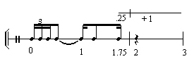
>
> ` 0.00 1 0 0 0`
> `0.17 1 0 0 0`
> `0.34 1 0 0 0`
> `0.50 1 0 0 0`
> `1.25 1 0 0 0`
> `1.75 1 0 0 0 `
>
> - There is no pitch, velocity or duration data in this definition --
>   their values are selected from the ranges given in the parameters.
> - The parameter pitch range here is only one pitch (60), so the rhythm
>   uses the same pitch for all its notes.
> - There is no tempo parameter in TIMED (*mult* in other programs), so
>   the starttimes have to be exactly what is wanted.
> - *Skiptime* in this case is 1.25, calculated from the last node of
>   the rhythmic template, at 1.75. 1.75 + 1.25 = 3, so the first repeat
>   of the figure will be at 3 sec. (4^th^ beat). A *skiptime* of 0.25
>   would cause the first repeat to be at 2 sec., i.e., it would
>   continue 'on the beat' without a pause.
> - The lack of control over velocity makes it hard to make the rhythmic
>   figure audible, as its dynamic shaping is completely flat. This
>   indicates that the mechanism of the rhythmic template will most
>   often be best used in conjunction with a fully defined motif
>   (TMOTIFS).
>
> **Practical work:** Alter *skiptime* to 0.25, making the soundfile
> **txws2b.aiff**. Notice how hard it is to pick out the rhythmic
> pattern, because the velocities are not (cannot) be adjusted. This can
> work to your advantage to create a rapid smooth flow. You might also
> try creating your own rhythmic template by editing the note data file.

## [Example 3]{#EXAMPLE3} -- regular repetitions of a melodic motif, each starting on the same pitch; overlap option

> [**Play txws3.aiff**](txws3.aiff)  Parameters:
> [**txwspla1-MAC.htm**](txwspla1-MAC.htm)  Preset: **txwsex3**
>
> TEXTURE MOTIFS, Mode **5**. The melodic motif is fully defined in the
> note data file, i.e., with pitch, velocity and duration. The pitch
> range in the parameters is again the same pitch (60), and this
> constrains the motif to *begin each time on that same pitch*, but does
> not inhibit the performance of the other pitches in the motif. The
> note data file [*txws3nd.txt*](txws3nd.txt) reads:
>
> ` 60`
> `#10 (Motif) `
>
> 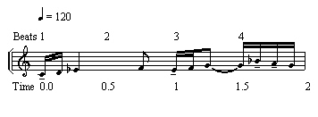
>
> ` 0.00 1 60 80 0.5`
> `0.25 1 62 60 0.5`
> `0.50 1 63 50 1.0`
> `1.50 1 65 70 0.5`
> `2.00 1 63 80 0.5`
> `2.25 1 65 80 0.5`
> `2.50 1 67 80 1.0`
> `3.25 1 70 90 0.5`
> `3.50 1 69 80 0.5`
> `3.75 1 67 70 0.5 `
>
> - Setting the lower and upper pitch parameters to the same pitch (in
>   this case 60) is essential to have the motif repeat again starting
>   on the same pitch and therefore also when seeking to achieve canonic
>   results, e.g., an arpeggio which overlaps.
> - *Mult* is employed to set a tempo. The motif starttimes are
>   calculated at crotchet = 60 = 1 sec., and the *mult* value of 0.5
>   yields a tempo of crotchet = 120. (**60 divided by the desired tempo
>   = *mult* value.**)
> - There is no *skiptime* here, so the timing of the repetitions is
>   controlled by the *packing*. This example uses a *packing* of 2,
>   which is the time one run of the motif takes **at crotchet = 120**.
>   Thus the next repetition will begin 'on the beat' at 2 sec.
> - A *packing* of 1 would initiate a repetition after 1 sec. (at time
>   2.00 in the ndf, due to the tempo) causing a contrapuntal overlap of
>   the figure. Note that *packing* must take into account the **real
>   playing time** as determined by the tempo.
>
> **Practical work:** Exploring the relationship of *packing* (time
> between repeats) and *mult* (tempo).
>
> - Alter *packing* to 1, creating **txws3b.aiff**. The figure will now
>   begin again after 1 second (beat 3) (at crotchet = 120, remember)
>   and therefore form a counterpoint.
> - Alter *mult* to 0.7 (crotchet = 84: 60/84 = 0.7), leaving *skiptime*
>   at 1, creating **txws3c.aiff**. The duration of each beat is now a
>   little longer than ½ sec., so the entry of the repeat after 1 sec.
>   will now be sooner than the 3rd beat of the figure and
>   cause the music to go out of sync.
> - Finally, let's work out how to get it back in sync at the slower
>   tempo. The length of each beat is 1 \* 0.7 and we want to have 2
>   beats before the repeat. 2 \* 0.7 = 1.4, so a *skiptime* of 1.4
>   should work. Try this, creating **txws3d.aiff**
> - You can now compare all three results, using *SoundShaper's*
>   **Reopen** facility.

## [Example 4]{#EXAMPLE4} -- repetitions of a melodic motif, each starting on the same pitch, according to a rhythmic template

> [**Play txws4.aiff**](txws4.aiff)  Parameters:
> [**txwspla1-MAC.htm**](txwspla1-MAC.htm)  Preset: **txwsex4**
>
> TEXTURE TMOTIFS, Mode **5**. Here we need the rhythmic template and
> the motif definition in the note data file *txws4nd.txt*:
>
> ` 60`
> `#5 (Rhythmic Template) `
>
> 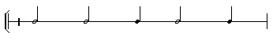
>
> ` 0.00 1 0 0 0`
> `2.00 1 0 0 0`
> `4.00 1 0 0 0`
> `5.00 1 0 0 0`
> `7.00 1 0 0 0 `
>
> ` #5 (Motif) `
>
> 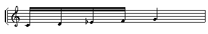
>
> ` 0.00 1 60 88 0.5`
> `0.25 1 62 84 0.5`
> `0.50 1 63 76 0.5`
> `0.75 1 65 72 0.5`
> `1.00 1 67 66 2.0 `
>
> - The rhythmic template sets a pattern of 2 + 2 + 1 + 2 + 1, with a
>   *skiptime* of 1 synchronous with this last 1 (because *skiptime*
>   starts on the last template time-point).
> - The melodic motif is a rising figure filling one beat and starting
>   the next. Exactly how long it lasts depends partly on the duration
>   of the last note of the figure, but more directly on the time at
>   which the next statement of the motif begins.
> - The motif repeats at the rhythmic template time points. Observe how
>   the onsets of the motif match the pattern of the rhythmic template.
>   In this example there is an overlap when the 2-sec motif begins
>   again after 1 sec.
> - The *skiptime* parameter refers to the time between **repetitions of
>   the whole rhythmic template**. The *skiptime* parameter (calculated
>   from the start time of the last note-event of the rhythmic template)
>   is set to 1 here because we want the whole sequence to last 8 full
>   beats (2, 4-beat 'bars'). *Skiptime* = 1 fills out the last beat
>   and causes it to repeat 'on the beat', i.e., at the beginning of
>   the next 'bar'.
>
> **Practical work:** Try this rhythmic template: 0.0 2.0 4.0 4.5 5.0
> 5.5 6.0 by editing the original note data file for this example in a
> text editor and saving it as *txws4n2.txt* (you can't SAVE AS within
> *SoundShaper*). Having loaded the Preset, now put the cursor in the
> note data file parameter and click on 'Open' next to the box
> displaying the file. You can now select your new file and open it.
> Make **txws4b.aiff** and see how the new template causes the figure to
> overlap.
>
> Now alter *mult low* to 0.625 (for crotchet = 96), leaving *mult high*
> at 1 (crotchet = 60), making **txws4c.aiff**. Now each repeat is at a
> different tempo and the overlaps go out of sync. A *mult* range of 0.5
> to 2 throws it out completely.
>
> A *position* of 0.5 and *spread* of 1 causes the motifs to move about
> in the horizontal field.

------------------------------------------------------------------------

> **[Section 2]{#SECTION2} -- Examples 5 to 8, illustrating PITCH RANGE:
> --** pitches selected at random from a pitch range; uses Mode **5**,
> with *minpitch* set lower than *maxpitch*. See
> [**txwspla2-MAC.htm**](txwspla2-MAC.htm) for the play list with all
> parameter values shown.

## [Example 5]{#EXAMPLE5} -- note events drawn at random from a pitch range, with time-scatter and spatialisation

> [**Play txws5.aiff**](txws5.aiff)  Parameters:
> [**txwspla2.htm**](txwspla2.htm)  Preset: **txwsex5**
>
> TEXTURE SIMPLE, Mode **5**. The main task here is to establish a pitch
> range from within which the note events will be selected. This is done
> with the *pitchlo* - *pitchhi* parameters, which here are set to an
> 8^ve^ range: 60 - 72. The note data file just requires the (possibly
> arbitrary) MIDI Pitch Value (MPV) as a pitch reference point. Thus
> [*txws5nd.txt*](txws5nd.txt) contains only '60'.
>
> - *Packing* ([*txws5pk.brk*](txws5pk.brk)) has been made to change
>   over time, accelerating from 0.25 to 0.025 over 9 seconds, then
>   dropping in the next hundredth of a second to 0.25 -- the breakpoint
>   times for different values cannot be exactly simultaneous -- and
>   speeding up slightly to 0.1 by the end of the file.
> - The output illustrates the random selection from a wider pitch
>   range, but cries out for more shaping!
>
> **Practical work:** The randomness of the pitch selection is
> (deliberately) very apparent in our original example due to the wide
> pitch range. Make the pitch range very narrow (e.g., 60-64) and the
> *packing* rate very fast, creating **txws5b.aiff**. You will need to
> edit the time-varying file *txws5pk.brk* to put in the smaller values,
> saving it to a new name. Then place the cursor in the *packing*
> parameter and click on 'Open' next to the box displaying the (old)
> file to open your new file. These changes will result in a dense,
> churning texture.
>
> To explore the other end of the spectrum, make the pitch range very
> wide (e.g., 48-86) while making the *packing* very slow, creating
> **txws5c.aiff**. Now the note-events are much separated in pitch and
> time. They call out for a much more distinctive sound, which could
> then 'ring out' with distinctive, transposed iterations.

## [Example 6]{#EXAMPLE6} -- regular repetitions of a rhythmic template on pitches drawn at random from a pitch range

> [**Play txws6.aiff**](txws6.aiff)  Parameters:
> [**txwspla2-MAC.htm**](txwspla2-MAC.htm)  Preset: **txwsex6**
>
> TEXTURE TIMED, Mode **5**. The definition of a rhythmic figure is
> achieved by defining a rhythmic template in the note data file. In
> this case, the note data file [*txws2nd.txt*](txws2nd.txt) reads (same
> as Ex. 2):
>
> ` 60`
> `#6 (Rhythmic Template) `
>
> 
>
> ` 0.00 1 0 0 0`
> `0.17 1 0 0 0`
> `0.34 1 0 0 0`
> `0.50 1 0 0 0`
> `1.25 1 0 0 0`
> `1.75 1 0 0 0 `
>
> This time the rhythmic template will be played on different pitches
> selected from within the range specified on the command line.
>
> - Note that each pitch is different, randomly selected from any pitch
>   within the pitch range, but the rhythm itself repeats. There is no
>   pitch-defined melodic motif.
> - The pitch range here is 60 to 72.
>
> **Practical work:** This function can develop more than at first meets
> the eye. The pitch range could be much tighter or spread wide, as we
> tried with Example 5. This time, re-do the rhythmic template to be
> much livelier. Edit the rhythmic template in the note data file, save
> to a new name and, having loaded the preset for this example, open the
> new note data file, as described in Example 4.

## [Example 7]{#EXAMPLE7} -- regular repetitions of 3 melodic motifs, each starting on pitches selected at random from a pitch range

> [**Play txws7.aiff**](txws7.aiff)  Parameters:
> [**txwspla2-MAC.htm**](txwspla2-MAC.htm)  Preset: **txwsex7**
>
> TEXTURE MOTIFS, Mode **5**. 3 motifs are defined in
> [*txws7nd.txt*](txws7nd.txt), which reads:
>
> ` 60`
> `#10 (Motif 1, C-B-F-G-C#-D Ab-F#-Bb-E) `
>
> 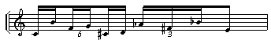
>
> ` 0.00 1 60 84 0.3`
> `0.17 1 71 70 0.3`
> `0.34 1 65 74 0.3`
> `0.50 1 67 56 0.3`
> `0.67 1 61 74 0.3`
> `0.84 1 62 60 0.3`
> `1.00 1 68 84 0.3`
> `1.17 1 66 60 0.3`
> `1.34 1 70 66 0.3`
> `1.50 1 64 78 0.3 `
>
> ` #1 (Motif 2) (C)`
> `0.00 1 60 60 2.0 `
>
> ` #10 (Motif 3, C-Db-G-F-B-Bb E-F#-D-G# - Mirror Inversion of Motif 1) `
>
> 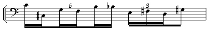
>
> ` 0.00 1 60 84 0.3`
> `0.17 1 49 70 0.3`
> `0.34 1 55 74 0.3`
> `0.50 1 53 56 0.3`
> `0.67 1 59 74 0.3`
> `0.84 1 58 60 0.3`
> `1.00 1 52 84 0.3`
> `1.17 1 54 60 0.3`
> `1.34 1 50 66 0.3`
> `1.50 1 56 78 0.3 `
>
> - Now there are 3 melodic motifs, which you can hear repeating,
>   starting on different pitches from within the pitch range. Although
>   the pitch range is only a perfect 5^th^, all the pitches of the
>   transposed motifs are present.
> - The *mult* factor is 0.5, which makes the tempo crotchet = 120. The
>   two-beat motifs therefore take 1 sec. to play. *Packing* is not
>   affected by *mult*, so you have to take account of the tempo when
>   setting the packing. The *packing* of 0.25 sec. therefore causes an
>   overlap of ¼ sec. at that tempo, i.e., *half*-way through the first
>   beat (the sextuplet).
> - The amplitude values are designed to bring out the rhythmic
>   character of the motifs.
> - This is an 'atonal' texture aiming towards a complex rush of
>   note-events.
>
> **Practical work:** The example in its original form is solid and
> driving. We can loosen it up nicely by varying the tempo. Load the
> Preset and give *mult* a 0.5 (crotchet = 120) to 0.7 (crotchet = 84)
> range, creating **txws7b.aiff**. Now each motif will be played at a
> tempo somewhere within this range, each one different. Note that the
> *mult* tempo parameters can also be time-varying!
>
> You can take it one step further by adding a time-varying breakpoint
> file for the *packing* parameter. Think how you would like the texture
> to speed up or slow down over its 12 second output duration, write the
> times and values in *txws7cpk.brk*, open it in the parameter page and
> create **txws7c.aiff**.

## [Example 8]{#EXAMPLE8} -- repetitions of a melodic motif, each starting on pitches drawn at random from a pitch range, according to a rhythmic template

> [**Play txws8.aiff**](txws8.aiff)  Parameters:
> [**txwspla2-MAC.htm**](txwspla2-MAC.htm)  Preset: **txwsex8**
>
> TEXTURE TMOTIFS, Mode **5**. The rhythmic template, designed to
> emphasise how overlapping figures can be created, and the motif are
> defined in [*txws8nd.txt*](txws8nd.txt), which reads:
>
> ` 60`
> `#11 (Rhythmic Template) `
>
> 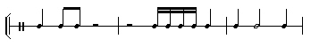
>
> `  0.00 1 0 0 0`
> ` 1.00 1 0 0 0`
> ` 1.50 1 0 0 0`
> ` 6.00 1 0 0 0`
> ` 6.25 1 0 0 0`
> ` 6.50 1 0 0 0`
> ` 6.75 1 0 0 0`
> ` 7.00 1 0 0 0`
> ` 8.00 1 0 0 0`
> ` 9.00 1 0 0 0`
> `11.00 1 0 0 0 `
>
> ` #14 ('Trill' Motif) `
>
> 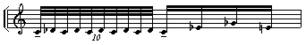
>
> ` 0.00 1 60 84 0.4`
> `0.10 1 61 80 0.4`
> `0.20 1 60 76 0.4`
> `0.30 1 61 72 0.4`
> `0.40 1 60 68 0.4`
> `0.50 1 61 76 0.4`
> `0.60 1 60 72 0.4`
> `0.70 1 61 68 0.4`
> `0.80 1 60 64 0.4`
> `0.90 1 61 60 0.4`
> `1.00 1 60 84 0.5`
> `1.25 1 63 72 0.5`
> `1.50 1 66 78 0.5`
> `1.75 1 64 72 0.5 `
>
> - The timing grid illustrates how overlap can be handled with timed
>   motifs. The *skiptime* parameter refers to the time between
>   repetitions *of the whole rhythmic template* and is calculated from
>   the starttime of the last node. The overlap we hear is caused by the
>   rhythmic template times.
> - The 'trill' motif repeats its pitches a great deal, and this
>   allows the ear to notice how the tuning is often microtonal when
>   selecting pitches from a pitch range. To lock onto specific pitches,
>   a harmonic field/set is needed.
>
> Thus the relationship between the time between the time points of the
> rhythmic template and the length of the motif(s) is a crucial factor
> in the design of the texture -- as is the design of the motif itself.
>
> **Practical work:** A good way to illustrate the relationship between
> template and motif would be to alter the rhythmic template for this
> example so that it started slow, with gaps, and then gradually placed
> the onsets of the motifs closer and closer together. You can do this
> by editing *txws8nd.txt*, saving as *txws8n2.txt* and opening it on
> the parameter page as the note data file to be used, creating
> **txws8b.aiff**.
>
> The effect of this time-compression and increasing overlap can be
> intensified by making the pitch range time-varying, moving from wide
> to narrow. Here we need create and open breakpoint files for the low
> and high pitch parameters: *txws8pl.brk* and txws8ph.brk, creating
> **txws8c.aiff**.

------------------------------------------------------------------------

> **[Section 3]{#SECTION3} -- Examples 9 to 12, illustrating HARMONIC
> SET: --** pitches selected at random from a user-defined harmonic set
> (uses *only* the named pitches); uses Mode **3**, with *minpitch* set
> lower than *maxpitch* in the pitch parameter breakpoint files. See
> [**txwspla3-MAC.htm**](txwspla3-MAC.htm) for the play list with all
> parameter values shown.

## [Example 9]{#EXAMPLE9} -- note events with pitches drawn at random from a user-defined harmonic set, with scatter

> [**Play txws9.aiff**](txws9.aiff)  Parameters:
> [**txwspla3-MAC.htm**](txwspla3-MAC.htm)  Preset: **txwsex9**
>
> TEXTURE SIMPLE, Mode **3**. This differs from Example 5 in that the
> randomly selected pitches are now restricted to a chord/harmonic
> configuration. This is defined in [*txws9nd.txt*](txws9nd.txt) as
> follows:
>
> ` 60`
> `#5 (Harmonic Set - C-E-F#-A-C') `
>
> 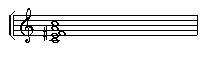
>
> ` 0 1 60 0 0`
> `0 1 64 0 0`
> `0 1 66 0 0`
> `0 1 69 0 0`
> `0 1 72 0 0 `
>
> - The degree to which the texture sounds like a 'chord', a
>   simultaneity, depends on the *packing* rate.
> - The time-varying *packing* file [*txws5pk.brk*](txws5pk.brk) is
>   retained here from Example 5 in order to show the effect of
>   different rates.
> - When the *packing* is tight and the input sound has a good signal
>   level, it may be necessary to activate the optional attenuation
>   parameter, here given the value 0.8 to reduce the level just enough
>   to avoid overload.
>
> **Practical work:** This might be a good point at which to create your
> own harmonic set. Edit *txws9nd.txt* accordingly, saving as
> *txws9n2.txt* and opening it on the parameter page, creating
> **txws9b.aiff**.
>
> Another area to explore would be the way this simple process can
> create a harmonised sonic texture. A quick way to get an idea of what
> can happen would be to load **whirrgdt.aiff**, a transformed version
> of **marimba.aiff** supplied with the Workshop, and then the Preset
> for Example 9 and remake the sound, creating **txws9c.aiff**. If this
> interests you, try creating your own sound, perhaps long with slow
> envelopes and with a reasably defined pitch. Remember to select
> 'whole input' (the **-w** flag so that your whole sound is used for
> every note-event in the texture.

## [Example 10]{#EXAMPLE10} -- regular repetitions of a rhythmic template on pitches drawn at random from a harmonic set

> [**Play txws10.aiff**](txws10.aiff)  Parameters:
> [**txwspla3-MAC.htm**](txwspla3-MAC.htm)  Preset: **txwsex10**
>
> TEXTURE TIMED, Mode **3**. The harmonic set defined in
> [*txws10nd.txt*](txws10nd.txt) is the minor 7^th^ chord C-Eb-G-Bb:
>
> ` 60`
> `#6 (Rhythmic Template) `
>
> 
>
> ` 0.00 1 0 0 0`
> `0.17 1 0 0 0`
> `0.34 1 0 0 0`
> `0.50 1 0 0 0`
> `1.25 1 0 0 0`
> `1.75 1 0 0 0 `
>
> ` #4 (Harmonic Set - C-Eb-G-Bb) `
>
> 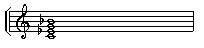
>
> ` 0 1 60 0 0`
> `0 1 63 0 0`
> `0 1 67 0 0`
> `0 1 70 0 0 `
>
> - What we have here is a rhythm repeating with random arpeggiation of
>   a chord.
> - The min and max pitch parameters need to accommodate the pitch span
>   of the harmonic set in the note data file. If it is not wide enough,
>   pitches will be omitted.
>
> **Practical work:** In Mode **3** ('Harmonic Set'), only the pitches
> defined in the note data file are used (as long as the low and high
> pitch parameters accomodate the range of this set). In all the
> examples, I use only the Harmonic Set Mode, so try remaking this
> example with Mode **1** selected ('Harmonic Field') and the pitch
> range extended to 36 - 96, creating **txws10b.aiff**. Now the program
> selects the pitches defined in the note data file *from any octave*
> within the pitch range. The marimba occasionally sounds like a
> prepared piano!

## [Example 11]{#EXAMPLE11} -- regular repetitions of a melodic motif, each starting on pitches drawn at random from a harmonic set

> [**Play txws11.aiff**](txws11.aiff)  Parameters:
> [**txwspla3-MAC.htm**](txwspla3-MAC.htm)   Preset: **txwsex11**
>
> TEXTURE MOTIFSIN, Mode **3**. Here the motif in
> [*txws11nd.txt*](txws11nd.txt) is designed so that it maintains the
> overall harmony as it transposes to the different pitches of the
> harmonic set and overlap in time. The note data file reads:
>
> ` 60`
> `#11 (Harmonic Set - IIº Mode of Limited Transposition) `
>
> 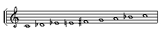
>
> ` 0.0 1 60 0 0`
> `0.0 1 61 0 0`
> `0.0 1 63 0 0`
> `0.0 1 64 0 0`
> `0.0 1 66 0 0`
> `0.0 1 67 0 0`
> `0.0 1 69 0 0`
> `0.0 1 70 0 0`
> `0.0 1 72 0 0`
> `0.0 1 73 0 0`
> `0.0 1 75 0 0 `
>
> ` #10 (Motif - C-Db-Eb-F#-Eb-Db-C-Bb C-Db) `
>
> 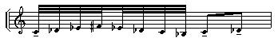
>
> ` 0.000 1 60 84 0.3`
> `0.125 1 61 60 0.3`
> `0.250 1 63 66 0.3`
> `0.375 1 66 72 0.3`
> `0.500 1 63 78 0.3`
> `0.625 1 61 66 0.3`
> `0.750 1 60 72 0.3`
> `0.875 1 58 78 0.3`
> `1.000 1 60 84 0.3`
> `1.500 1 61 84 0.3 `
>
> - This is interesting. Because a harmonic set is used, unlike MOTIFS
>   Mode **5**, the pitches of the motif, transposed or not transposed,
>   will not play if they are not present in the Harmonic Set.
> - However, there will be repetitions in the upper part of the range if
>   a pitch high in the Set is selected as a start pitch for the motif:
>   the motif runs out of pitches if it tries to go above the top of the
>   Set. Extending the Set higher allows these motifs to sound
>   correctly, but the same problem occurs if an even higher pitch is
>   selected as a start point.
> - This texture is designed to be a smooth, sonorous wash. Besides a
>   *packing* of 0.25 to create overlap and a fast tempo (*mult* = 0.5),
>   the whole input sound is used in order to achieve this, but with
>   limited success due to the sharp attack and quick decay of the
>   marimba sound.
>
> **Practical work:** As tried before, this texture can be 'loosened
> up' by providing a range for the *mult* tempo low-high parameters.
> Also, the 'wash' effect is increased when the sound has a softer
> attack transient -- try using **whirrgdt.aiff** as an input.
>
> But to tie in with the discussion about the relationship of the motif
> to the harmonic set, let's see what happens when the harmonic set is
> restricted by making the parameter pitch range 62 - 67, a perfect
> fourth. Using the marimba sound as the input, load the Preset and
> later the pitch parameters, creating **txws11b.aiff**. The results are
> remarkable.
>
> Refer to TEXTURE ORNATE as a way to 'tie down' the motif start
> pitches to specific pitches of the harmonic set, i.e., those defined
> in the 'line' (nodal substructure) of the note data file.

## [Example 12]{#EXAMPLE12} -- repetitions of 4 melodic motifs, each starting on pitches drawn at random from a harmonic set, according to a rhythmic template; 2 soundfile inputs

> [**Play txws12.aiff**](txws12.aiff)  Parameters:
> [**txwspla3-MAC.htm**](txwspla3-MAC.htm)  Preset: **txwsex12**
>
> TEXTURE TMOTIFSIN, Mode **3**. The new source is
> [**gtrcdt.aiff**](gtrcdt.aiff) (a guitar sound, MPV 57), and
> marimba.aiff is given as the second source. The note data file
> [*txws12nd.txt*](txws12nd.txt) reads:
>
> ` 57 60`
> `#9 (Rhythmic Template) `
>
> 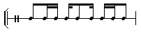
>
> ` 0.00 1 0 0 0`
> `0.50 1 0 0 0`
> `0.75 1 0 0 0`
> `1.00 1 0 0 0`
> `1.25 1 0 0 0`
> `1.75 1 0 0 0`
> `2.00 1 0 0 0`
> `2.25 1 0 0 0`
> `2.50 1 0 0 0 `
>
> ` #8 (Harmonic Set) `
>
> 
>
> ` 0.0 1 60 0 0`
> `0.0 1 61 0 0`
> `0.0 1 63 0 0`
> `0.0 1 66 0 0`
> `0.0 1 67 0 0`
> `0.0 1 69 0 0`
> `0.0 1 70 0 0`
> `0.0 1 72 0 0 `
>
> ` #7 (Motif 1, C-Db-Eb-F#-G-A-Bb) `
>
> 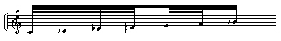
>
> ` 0.000 1 60 84 0.3`
> `0.125 1 61 84 0.3`
> `0.250 1 63 84 0.3`
> `0.375 1 66 84 0.3`
> `0.500 1 67 68 0.3`
> `0.625 1 69 72 0.3`
> `0.750 1 70 68 0.3 `
>
> ` #11 (Motif 2, C'-A-Bb-A-G-F# G-A-G-F#-Eb) `
>
> 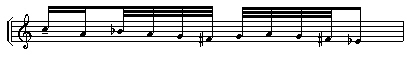
>
> ` 0.000 1 72 80 0.3`
> `0.250 1 69 78 0.3`
> `0.500 1 70 78 0.3`
> `0.625 1 69 78 0.3`
> `0.750 1 67 78 0.3`
> `0.875 1 66 78 0.3`
> `1.000 1 67 78 0.3`
> `1.125 1 69 68 0.3`
> `1.250 1 67 72 0.3`
> `1.375 1 66 68 0.3`
> `1.500 1 63 76 0.3 `
>
> ` #5 (Motif 3 - 'strummed' chord 1, C-Eb-F-A-C') `
>
> 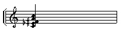
>
> ` 0.00 1 60 80 1.0`
> `0.01 1 63 80 1.0`
> `0.02 1 66 80 1.0`
> `0.03 1 69 80 1.0`
> `0.04 1 72 80 1.0 `
>
> ` #5 (Motif 4 - 'strummed' chord 2, Db-F#-G-A-Bb) `
>
> 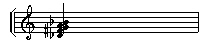
>
> ` 0.00 1 61 80 1.0`
> `0.01 1 66 80 1.0`
> `0.02 1 67 80 1.0`
> `0.03 1 69 80 1.0`
> `0.04 1 70 80 1.0 `
>
> - The last two motifs are rapid arpeggiations. They sound like
>   strumming a chord when the guitar sound is selected (rapid up or
>   down arpeggiation).
> - The key to this lively and unpredictable texture is the rhythmic
>   template: Q-SQ-SQ, SQ-Q-SQ, SQ-SQ-Q. This pattern starts events
>   close to each other and also is 'rhythmic' in itself.
> - The exact relationship between the harmonic set and the pitch range
>   is an interesting issue. Here, the pitch range is set wider than the
>   harmonic set. This is to allow the motifs (which start within the
>   harmonic set) to run their course. When the pitch range equals that
>   of the harmonic set, some descending motifs which start near the
>   bottom or ascending motifs which start near the top appear to be
>   truncated, with some shapes warped and extra repeated notes. In this
>   particular texture, extra unsolicited repeated notes fit right in!
> - The tempo is just about crotchet = 84. (60 divided by 84 = 0.7, the
>   value given for *mult*).
>
> **Practical work:** This time, edit the note data file *txws12nd.txt*
> replacing the first motif with one of your own design, saving as
> *txws12n2.txt* and creating **txws12b.aiff**. This will raise the
> *compositional* issues of how to relate the motif to the harmonic set
> and what rhythm might be effective.
>
> It would also be interesting to 'loosen up' this very rhythmic
> texture by providing a fairly wide tempo range, e.g., *mult* = 0.5 to
> 1.4.

------------------------------------------------------------------------

> **[Section 4]{#SECTION4} -- Examples 13 to 16, illustrating
> TIME-VARYING Parameters: --** e.g., pitches selected at random from a
> *changing* harmonic set, with time-varying pitch contours. Uses Mode
> **4** (changing harmonic fields or sets), with *minpitch* set lower
> than *maxpitch* in the pitch parameter breakpoint files. See
> [**txwspla4-MAC.htm**](txwspla4-MAC.htm) for the play list with all
> parameter values shown.

> ## [Example 13]{#EXAMPLE13} -- note events are selected at random from harmonic sets which change at a specified time-point, and which unfurl by means of time-varying pitch parameters.
>
> > [**Play txws13.aiff**](txws13.aiff)  Parameters
> > [**txwspla4-MAC.htm**](txwspla4-MAC.htm)  Preset: **txwsex13**
> >
> > TEXTURE SIMPLE, Mode **4**. Now, we not only select pitches from a
> > harmonic set, but also change the set at the half-way point, thus
> > introducing a chord change. These are defined
> > [*txws13nd.txt*](txws13nd.txt)
> >
> > ` 60`
> > `#10 (Changing Harmonic Set) `
> >
> > 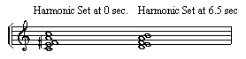
> >
> > ` 0 1 60 0 0 (1`^`st`^` chord, C-E-F#-A-C')`
> > `0 1 64 0 0`
> > `0 1 66 0 0`
> > `0 1 69 0 0`
> > `0 1 72 0 0`
> > `6.5 1 62 0 0 (2`^`nd`^` chord, D-E-F-A-B)`
> > `6.5 1 64 0 0`
> > `6.5 1 65 0 0`
> > `6.5 1 69 0 0`
> > `6.5 1 71 0 0 `
> >
> > - In addition to the use of the two harmonic sets, we have now
> >   introduced time-varying pitch parameters with the files
> >   [*txws13pl.brk*](txws13pl.brk) and [*txws13ph.brk*](txws13ph.brk).
> >   These expand outward, up and down, from a pitch near the middle of
> >   the first set, until the extremities of the set are reached. They
> >   then hold this position (so the full set can be heard) change to
> >   the second set, hold that, and then compress inward to a pitch
> >   near the middle of the second set.
> > - Time-varying *packing* is also retained with
> >   [*txws13pk.brk*](txws13pk.brk), but adapted to be faster overall
> >   and fastest during the changeover from the 1^st^ to the 2^nd^ set.
> > - The important thing to observe in this example is how the
> >   time-varying pitch parameters succeed in gradually unveiling and
> >   covering the full set (chord) definitions.
> > - There is a soft overlap of the two sets due to the random time and
> >   pitch locations of each note-event. This overlap is more
> >   pronounced with longer sounds and slower *packing* rates,
> >   producing gently changing, sonorous textures, given a suitable
> >   sound.
> >
> > The number of parameters now altering over time in Example 13 is
> > beginning to produce more supple and 'musical' results.
> >
> > **Practical work:** We can explore the overlay of time-varying pitch
> > parameters and the underlying harmonic set by reversing the way the
> > contours work. In the original example, we start narrow and widen,
> > so that the full harmonic set is being used at the point of
> > changeover to the 2nd chord. Let's start wide and move
> > to narrow at the time of changeover, then back to wide again. Thus
> > the texture will focus in on a specific pitch, move to the next
> > chord and open out again -- like going through a gateway into a
> > different landscape.
> >
> > To do this, you can edit the existing pitch parameter breakpoint
> > files *txws13pl.brk* and *txws13ph.brk*, saving to new names (e.g.,
> > *txws13lp.brk* and *txws13hp.brk*) and opening them as the files to
> > be used as the new pitch parameters.
>
> ## [Example 14]{#EXAMPLE14} -- repetitions of a rhythmic template on pitches selected at random from a changing harmonic set, with time-varying pitch parameters
>
> > [**Play txws14.aiff**](txws14.aiff)  Parameters:
> > [**txwspla4-MAC.htm**](txwspla4-MAC.htm)  Preset: **txwsex14**
> >
> > TEXTURE TIMED, Mode **4** A more complex rhythmic template is
> > defined in [*txws14nd.txt*](txws14nd.txt), along with a changing
> > harmonic set:
> >
> > ` 60`
> > `#28 (Rhythmic Template) `
> >
> > 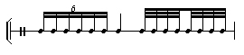
> >
> > ` 0.000 1 0 0 0 (First 3 beats)`
> > `0.170 1 0 0 0`
> > `0.340 1 0 0 0`
> > `0.500 1 0 0 0`
> > `0.670 1 0 0 0`
> > `0.840 1 0 0 0`
> > `1.000 1 0 0 0`
> > `2.000 1 0 0 0`
> > `2.125 1 0 0 0`
> > `2.250 1 0 0 0`
> > `2.375 1 0 0 0`
> > `2.500 1 0 0 0`
> > `2.625 1 0 0 0`
> > `2.750 1 0 0 0`
> > `2.875 1 0 0 0 `
> >
> > 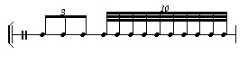
> >
> > ` 3.00 1 0 0 0 (Last 2 beats)`
> > `3.34 1 0 0 0`
> > `3.67 1 0 0 0`
> > `4.00 1 0 0 0`
> > `4.10 1 0 0 0`
> > `4.20 1 0 0 0`
> > `4.30 1 0 0 0`
> > `4.40 1 0 0 0`
> > `4.50 1 0 0 0`
> > `4.60 1 0 0 0`
> > `4.70 1 0 0 0`
> > `4.80 1 0 0 0`
> > `4.90 1 0 0 0 `
> >
> > ` #10 (Changing Harmonic Set) `
> >
> > 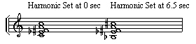
> >
> > ` 0.0 1 60 0 0 (1`^`st`^` chord, C-Eb-F#-A-C')`
> > `0.0 1 63 0 0`
> > `0.0 1 66 0 0`
> > `0.0 1 69 0 0`
> > `0.0 1 72 0 0`
> > `6.5 1 58 0 0 (2`^`nd`^` chord, Bb-Eb-Gb-A-Db)`
> > `6.5 1 63 0 0`
> > `6.5 1 66 0 0`
> > `6.5 1 69 0 0`
> > `6.5 1 73 0 0 `
> >
> > - The absence of amplitude shaping does make it difficult to pick
> >   out the rhythmic groups, but this can be advantageous if the
> >   texture is meant to flow together.
> > - The [*txws14pl.brk*](txws14pl.brk) low pitch breakpoint file stays
> >   on the lowest pitches of the chords, while the
> >   [*txws14ph.brk*](txws14ph.brk) high pitch breakpoint file moves
> >   gradually up to the top, and then steps back at 13.0 sec.
> > - Limitations: *skiptime* can't go back to near the beginning of
> >   the rhythmic template for a large overlap, and there is no tempo
> >   control.
> >
> > Although limited, a sharply defined and vigorous rhythmic template
> > is possible, and the time-varying handling of changing harmonic
> > configurations is available.
> >
> > **Practical work:** Once again, let's remake this example using
> > Mode **2** (changing harmonic field). We can replace the
> > time-varying pitch parameter files with constants so that the pitch
> > range will be 36 to 96. Ticking 'whole sound' (**-w** flag)
> > ensures that we don't unnecessarily reduce the length of the
> > sounds. Creating **txws14b.aiff** and listening to the result,
> > perhaps you will be enticed to try this again with different sound
> > inputs.
>
> ## [Example 15]{#EXAMPLE15} -- repetition of 4 melodic motifs, each note of which randomly selects a pitch from within the changing harmonic set, within time-varying packing and a tempo range
>
> > [**Play txws15.aiff**](txws15.aiff)  Parameters:
> > [**txwspla4-MAC.htm**](txwspla4-MAC.htm)  Preset: **txwsex15**
> >
> > TEXTURE MOTIFSIN, Mode **4**. A changing harmonic set and 4 motifs
> > are defined in [*txws15nd.txt*](txws15nd.txt), which reads:
> >
> > ` 60`
> > `#11 (Changing Harmonic Set) `
> >
> > 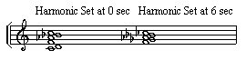
> >
> > ` 0.0 1 60 0 0 (harmonic set, chord 1)`
> > `0.0 1 62 0 0`
> > `0.0 1 65 0 0`
> > `0.0 1 68 0 0`
> > `0.0 1 70 0 0`
> > `0.0 1 72 0 0`
> > `6.0 1 65 0 0 (harmonic set, chord 2)`
> > `6.0 1 66 0 0`
> > `6.0 1 68 0 0`
> > `6.0 1 70 0 0`
> > `6.0 1 71 0 0`
> >
> > ` #9 (Motif 1, C-D-AB-C'-Bb-F D-D-D) `
> >
> > 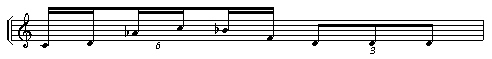
> >
> > ` 0.00 1 60 80 0.6`
> > `0.17 1 62 72 0.5`
> > `0.34 1 68 78 0.6`
> > `0.50 1 72 76 0.5`
> > `0.67 1 70 78 0.6`
> > `0.84 1 65 72 0.5`
> > `1.00 1 62 80 0.8`
> > `1.34 1 62 76 0.8`
> > `1.67 1 62 72 0.8 `
> >
> > ` #4 (Motif 2, C-D Ab-C') `
> >
> > 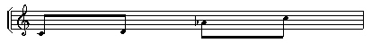
> >
> > ` 0.00 1 60 80 1.0`
> > `0.50 1 62 80 1.0`
> > `1.00 1 68 80 1.0`
> > `1.50 1 72 80 1.0 `
> >
> > ` #8 (Motif 3, C-Bb-C'-Bb-D Ab-Ab-Ab) `
> >
> > 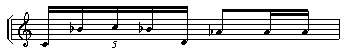
> >
> > ` 0.00 1 60 80 0.5`
> > `0.20 1 70 76 0.5`
> > `0.40 1 72 72 0.5`
> > `0.60 1 70 76 0.5`
> > `0.80 1 62 72 0.5`
> > `1.00 1 68 80 1.0`
> > `1.50 1 68 76 1.0`
> > `1.75 1 68 72 1.0 `
> >
> > ` #11 (Motif 4, C-D-Ab C-Bb-Ab-F-Ab-F-D-C) `
> >
> > 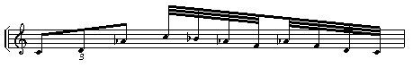
> >
> > ` 0.000 1 60 80 0.7`
> > `0.340 1 62 80 0.7`
> > `0.670 1 68 80 0.7`
> > `1.000 1 72 80 0.7`
> > `1.125 1 70 80 0.7`
> > `1.250 1 68 80 0.7`
> > `1.375 1 65 80 0.7`
> > `1.500 1 68 80 0.7`
> > `1.625 1 65 80 0.7`
> > `1.750 1 62 80 0.7`
> > `1.875 1 60 80 0.7 `
> >
> > - A small pitch range is given (60 to 64), which provides start
> >   locations for the 4 fully defined motifs. All the pitches they
> >   need are present in the first chord of the changing harmonic set,
> >   and they play reasonably well. I think there are some pitch
> >   repetitions, but not so many as there might have been because (?)
> >   all the motifs have been designed to start on C-60.
> > - When the 2^nd^ chord of the changing harmonic set comes in, the
> >   motifs are partially warped to it and more pitch repetitions
> >   occur, but nevertheless the new chord does come through.
> > - There is a gentle suppleness in the texture due to a *mult*
> >   (tempo) range of 0.8 to 1.2, and the amount of overlap increases
> >   in a time-varying way in the *packing* breakpoint file
> >   [*txws15pk.brk*](txws15pk.brk).
> >
> > One could hope for a better warping of motif to harmonic set, but
> > within its limitations, this function can produce some delightful
> > results. Designing the motifs to work with the harmonic set is a key
> > aspect of the compositional process.
> >
> > **Practical work:** We have a changing harmonic field, time-varying
> > packing, time-varying tempo and 4 motifs in this example. The result
> > is nicely supple. Now make several new outputs, using exactly the
> > same settings as in the Preset, saving to **txws15b.aiff** etc. What
> > we learn from this is how much the program is making random choices,
> > for each output is quite different from the one before, mainly due
> > to the choices about what tempo and which motif for each note event.
> > Sometimes when you are making a texture and it doesn't seem to turn
> > out quite right, try making it again -- a fresh run with the same
> > parameters may produce a useful result, closer to what you intended.
> > These trials provide a good illustration of how the Texture software
> > incorporates and can balance the random and the defined.
>
> ## [Example 16]{#EXAMPLE16} -- repetitions of 2 melodic motifs, each starting on pitches drawn at random from a changing harmonic set, with time-varying pitch range contours, according to a rhythmic template
>
> > [**Play txws16.aiff**](txws16.aiff)  Parameters:
> > [**txwspla4-MAC.htm**](txwspla4-MAC.htm)  Preset: **txwsex16**
> >
> > TEXTURE TMOTIFSIN, Mode **4**. [Guitar](gtrcdt.aiff) \[MPV-57\] and
> > [marimba](marimba.aiff) \[MPV-60\] are the two inputs into a
> > changing harmonic set with 4 motifs on a rhythmic template. The
> > rhythmic template is a 'hemiola' (sextuplet \[in two groups of 3\]
> > followed by a triplet over the same time). All this is defined in
> > the note data file [*txws16nd.txt*](txws16nd.txt), which reads:
> >
> > ` 57 60 (MPV's for two soundfiles)`
> > `#9 ('hemiola' rhythmic template) `
> >
> > 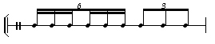
> >
> > ` 0.00 1 0 0 0`
> > `0.17 1 0 0 0`
> > `0.34 1 0 0 0`
> > `0.50 1 0 0 0`
> > `0.67 1 0 0 0`
> > `0.84 1 0 0 0`
> > `1.00 1 0 0 0`
> > `1.34 1 0 0 0`
> > `1.67 1 0 0 0 `
> >
> > ` #10 (Changing Harmonic Set) `
> >
> > 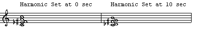
> >
> > ` 0.0 1 60 0 0 (Harmonic Set, chord 1, C-Eb-F#-A-C)`
> > `0.0 1 63 0 0`
> > `0.0 1 66 0 0`
> > `0.0 1 69 0 0`
> > `0.0 1 72 0 0`
> > `10.0 1 60 0 0 (Harmonic Set, chord 2, C-Db-F#-G-B)`
> > `10.0 1 61 0 0`
> > `10.0 1 66 0 0`
> > `10.0 1 67 0 0`
> > `10.0 1 71 0 0 `
> >
> > ` #5 (Strummed chord 1, C-Eb-F#-A-C) `
> >
> > 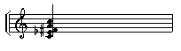
> >
> > ` 0.00 1 60 80 1.0`
> > `0.01 1 63 80 1.0`
> > `0.02 1 66 80 1.0`
> > `0.03 1 69 80 1.0`
> > `0.04 1 72 80 1.0 `
> >
> > ` #5 (Strummed chord 2, C-Db-F#-G-B) `
> >
> > 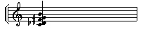
> >
> > ` 0.00 1 60 80 1.0`
> > `0.01 1 61 80 1.0`
> > `0.02 1 66 80 1.0`
> > `0.03 1 67 80 1.0`
> > `0.04 1 71 80 1.0 `
> >
> > ` #14 (Melodic figure 1) `
> >
> > 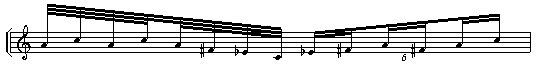
> >
> > ` 0.000 1 69 80 0.3`
> > `0.125 1 72 78 0.3`
> > `0.250 1 69 78 0.3`
> > `0.375 1 72 80 0.3`
> > `0.500 1 69 78 0.3`
> > `0.625 1 66 78 0.3`
> > `0.750 1 63 78 0.3`
> > `0.875 1 60 78 0.3`
> > `1.000 1 63 84 0.3`
> > `1.170 1 66 72 0.3`
> > `1.340 1 69 80 0.3`
> > `1.500 1 66 72 0.3`
> > `1.670 1 69 80 0.3`
> > `1.840 1 72 76 0.3 `
> >
> > ` #14 (Melodic figure 2) `
> >
> > 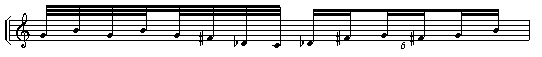
> >
> > ` 0.000 1 67 80 0.3`
> > `0.125 1 71 78 0.3`
> > `0.250 1 67 78 0.3`
> > `0.375 1 71 80 0.3`
> > `0.500 1 67 78 0.3`
> > `0.625 1 66 78 0.3`
> > `0.750 1 61 78 0.3`
> > `0.875 1 60 78 0.3`
> > `1.000 1 61 84 0.3`
> > `1.170 1 66 72 0.3`
> > `1.340 1 67 80 0.3`
> > `1.500 1 66 72 0.3`
> > `1.670 1 67 80 0.3`
> > `1.840 1 71 76 0.3 `
> >
> > - It is fascinating how the strummed chords and 14-note motifs mix
> >   together. The different figures are made more audible by having
> >   two sound inputs.
> > - There are also time-varying pitch parameters, with the [upper
> >   trace](txws16ph.brk) holding steady at the top of each Harmonic
> >   Set, and the [lower trace](txws16pl.brk) descending from A to the
> >   bottom over 0-6 seconds and then rising from the bottom to the G
> >   over 14-20 sec.
> > - The warping of the chords to the respective Harmonic Sets works
> >   reasonably well although either may be randomly selected during
> >   the time either Set is active.
> >
> > Although much in this texture is very precisely defined, the
> > randomised motif selection and time-varying pitch contours make the
> > result unpredictably complex and wonderfully fluid.
> >
> > **Practical work:** Variants on this example will yield much
> > information. For example, if you keep the lower pitch range constant
> > at Middle C (60) and allow the upper one to move gradually from
> > Middle C upwards to B (71), you do hear the texture opening out, but
> > also notice that all (most?) of the pitches of the strummed chords
> > are heard whenever they play. Make a new upper pitch range
> > breakpoint file (e.g., *txws16hp.brk*), set the lower one to 60 and
> > create **txws16b.aiff**.
> >
> > Why should some motifs be restricted by the outer pitch contour and
> > others not? Remember that each motif will begin on a pitch randomly
> > selected from the harmonic set. The strummed chords play because
> > their bottom pitch is always within the range. Compare the result
> > you get when the pitch range is 66-67, creating **txws16c.aiff**.
> >
> > Also instructive is what happens when the rhythmic template uses a
> > 'Latin' rhythm which has longer note values, such as a samba or
> > rumba. Having altered *txws16nd.txt* to form *txws16n2.txt*, create
> > **txws16d.aiff** with your own rhythmic template. Remember to adjust
> > the number of note events in the template and the *skiptime*
> > parameter -- and possibly the tempo as well.
> >
> > Finally, alter the Harmonic Set so that it consists of 2 dyads:
> > 63-66 for the first 10 seconds, and 67-71 for the second 10 seconds,
> > creating **txws16e.aiff**. Now the full motifs are no longer played.
> > The strummed chords have fewer notes and the other motifs play with
> > many repeated notes, as the motifs are warped to the pitches defined
> > in the Harmonic Set.
>
> ------------------------------------------------------------------------
>
> > **[Section 5]{#SECTION5} -- Examples 17 - 20, illustrating NODAL
> > SUBSTRUCTURE: --** attaching a decoration or an ornament (or several
> > selected at random) to a 'line' (nodal substructure), with or
> > without a harmonic field or set. See
> > [**txwspla5-MAC.htm**](txwspla5-MAC.htm) for the play list with all
> > parameter values shown.
>
> ## [Example 17]{#EXAMPLE17} -- repetitions of a (timed) nodal substructure, on the pitches (and at the times) of which 'decorations' are attached, decorations made up of note-events randomly shaped within the constraints of group parameters.
>
> > [**Play txws17.aiff**](txws17.aiff)  Parameters:
> > [**txwspla5-MAC.htm**](txwspla5-MAC.htm)  Preset: **txwsex17**
> >
> > TEXTURE POSTDECOR, Mode **5**. The Nodal Substructure and a Harmonic
> > Set are defined in [*txws17nd.txt*](txws17nd.txt), which reads:
> >
> > ` 60`
> > `#13 (Nodal Substructure) `
> >
> > 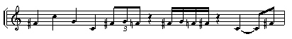
> >
> > ` 0.0 1 66 0 0`
> > `1.0 1 72 0 0`
> > `2.0 1 67 0 0 (Crotchets: F# C' G C)`
> > `3.0 1 60 0 0`
> > `4.0 1 66 0 0 (Quaver Triplet: F# G F)`
> > `4.34 1 67 0 0`
> > `4.67 1 65 0 0`
> > `6.00 1 66 0 0 (Semiquavers: F# G F F#)`
> > `6.25 1 67 0 0`
> > `6.50 1 65 0 0`
> > `6.75 1 66 0 0`
> > `8.00 1 60 0 0 (Dotted crotchet: C)`
> > `9.50 1 66 0 0 (Dotted crotchet, with skiptime: F#)`
> >
> > ` #13 (Harmonic Set) `
> >
> > 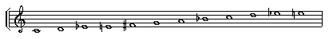
> >
> > ` 0.0 1 60 0 0`
> > `0.0 1 62 0 0`
> > `0.0 1 63 0 0`
> > `0.0 1 64 0 0`
> > `0.0 1 65 0 0`
> > `0.0 1 66 0 0`
> > `0.0 1 67 0 0`
> > `0.0 1 69 0 0`
> > `0.0 1 70 0 0`
> > `0.0 1 72 0 0`
> > `0.0 1 74 0 0`
> > `0.0 1 75 0 0`
> > `0.0 1 76 0 0`
> >
> > - The Nodal Substructure is designed to create a clear outline on
> >   which the decorations will appear, but with time compression via
> >   the triplet and semiquaver time intervals in order to show the
> >   capacity for density and overlap.
> > - *Centring* is 1, which places the decoration on & above the nodal
> >   pitch.
> > - The 'group' parameters shape the decoration, randomly selecting
> >   between the low and high values for *gpsize* (number of
> >   note-events in each decoration), *gppack* (time in milliseconds
> >   between each decoration note-event), and *gprange* (range of notes
> >   in the Harmonic Set to use for each decoration -- not MIDI Pitch
> >   Values, but simply the number of notes to use out of the full list
> >   of notes in the Harmonic Set).
> > - The Harmonic Set accommodates the nodal pitches and some pitches
> >   surrounding the nodes, but maintaining a fairly 'diatonic' feel.
> >
> > **Practical work:** The motifs are created on the fly according to
> > the ranges given for the 'group' parameters: size, packing and
> > range. The potential of this function can be explored by using more
> > extreme values and doing so in a time-varying manner. Therefore,
> > write a time-varying breakpoint file for the low and high limits of
> > each of these parameters, introducing considerably more contrast.
> > When doing this, note the timing of events in the rhythmic template.
> > Then load the Preset and then your new breakpoint files, creating
> > **txws17b.aiff**. If you compare this result with the original, you
> > should find that your time-varying decorations are considerably more
> > interesting and supple.
>
> ## [Example 18]{#EXAMPLE18} -- repetitions of a (timed) nodal substructure, on the pitches (and at the times) of which a long fully defined 'ornament' is attached, transposing with intervallic exactness.
>
> > [**Play txws18.aiff**](txws18.aiff)  Parameters:
> > [**txwspla5-MAC.htm**](txwspla5-MAC.htm)
> >
> > TEXTURE POSTORNATE, Mode **5**. The note data file
> > [*txws18nd.txt*](txws18nd.txt) contains only the Nodal Substructure
> > and a rather extended 'ornament'. In earlier examples I was
> > stressing the need to use the same pitch as min and max values so
> > that the motif would repeat canonically with the same start pitch.
> > Here I am using the Nodal Substructure mechanism to achieve canonic
> > repeats with transpositions.
> >
> > ` 57 60`
> > `#6 (Nodal Substructure) `
> >
> > 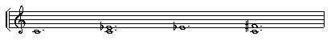
> >
> > ` 0.000 1 60 0 0`
> > `4.980 1 60 0 0`
> > `4.981 1 63 0 0`
> > `9.960 1 63 0 0`
> > `14.940 1 66 0 0`
> > `14.941 1 60 0 0`
> >
> > ` #38 (Extended Melody 'Ornament') `
> >
> > 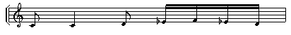
> >
> > ` 0.00 1 60 80 1.0`
> > `0.50 1 60 80 2.0`
> > `1.50 1 62 80 1.0`
> > `2.00 1 63 80 0.4`
> > `2.25 1 65 72 0.4`
> > `2.50 1 63 76 0.4`
> > `2.75 1 62 72 0.4`
> >
> > 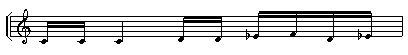
> >
> > ` 3.00 1 60 80 0.4`
> > `3.25 1 60 76 0.6`
> > `3.50 1 60 80 2.0`
> > `4.50 1 62 80 0.4`
> > `4.75 1 62 76 0.4`
> > `5.00 1 63 80 0.4`
> > `5.25 1 65 72 0.4`
> > `5.50 1 62 76 0.4`
> > `5.75 1 63 72 0.4`
> >
> > 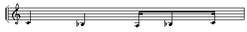
> >
> > ` 6.00 1 60 80 2.1`
> > `7.00 1 58 80 2.1`
> > `8.00 1 57 73 0.4`
> > `8.25 1 58 74 0.4`
> > `8.75 1 60 76 0.4`
> >
> > 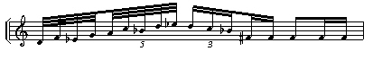
> >
> > ` 9.000 1 62 77 0.4`
> > `9.125 1 65 78 0.4`
> > `9.250 1 63 79 0.4`
> > `9.375 1 67 80 0.4`
> > `9.500 1 69 81 0.3`
> > `9.600 1 72 82 0.3`
> > `9.700 1 70 83 0.3`
> > `9.800 1 74 84 0.3`
> > `9.900 1 75 75 0.3`
> > `10.00 1 74 88 0.3`
> > `10.17 1 72 87 0.3`
> > `10.34 1 70 86 0.3`
> > `10.50 1 66 86 0.4`
> > `10.75 1 66 83 0.4`
> > `11.00 1 66 88 1.0`
> > `11.50 1 66 84 0.4`
> > `11.75 1 66 80 0.4`
> >
> > - The transposition pitches of the Nodal Substructure (C-Eb-F#) aim
> >   to reduce the creation of dissonances.
> > - Mode **5** is used to limit the transpositions to the precise
> >   pitches named in the Nodal Substructure. (In Mode **5** only the
> >   initial pitch is affected -- the rest of the ornament follows as
> >   an intervallically exact transposition from that new reference
> >   pitch.
> > - Note that *mult* is set to 0.83 (for crotchet = 72) and that the
> >   start times of the Nodal Substructure events have to be
> >   re-calculated 'by hand' accordingly. Here I wanted to repeat the
> >   motif every 6 beats. With *mult* at 0.83, these are no longer
> >   seconds, so 6, 12 and 18 have to be multiplied by 0.83 to get the
> >   new times to keep things in sync. Thus they become 4.98, 9.96 and
> >   14.94.
> > - Additional virtually simultaneous repeats (causing intervals) are
> >   included by setting start times 1/1000^th^ of a second later.
> >
> > **Practical work:** May I suggest working on a 'round' as a way of
> > getting deeper into the potential of this program. Once you can do
> > something as controlled as that, it is easier to start to loosen it
> > up. Here are some pointers:
> >
> > - A round is a series of phrases all on the same harmony, designed
> >   to sound well together when the entries are staggered, usually by
> >   starting each phrase on a different note of the chord: when the
> >   phrases overlap and are put together, so is the (single) harmony.
> > - To create a standard round using POSTORNATE Mode 5, such as *Frère
> >   Jaques*, you will need to write all the phrases as a single
> >   'ornament', otherwise the phrases will be selected at random.
> >   Try realising a familiar round with the whole tune one ornament,
> >   and then your own original round done in the same way.
> > - The 'line' of nodal points specify the start time and start
> >   pitch of each entry. To have each voice use the same pitches, all
> >   the nodal points need to be at the same pitch.
> > - *Skiptime* is the time from the **last nodal time point** to the
> >   point of the next entry -- NOT simply the time between the end of
> >   one ornament and the start of the next. *Skiptime* and nodal time
> >   points can be combined in various ways in order to achieve
> >   different kinds of overlap -- this is tricky stuff.
> >   1.  You can set the node time points to start a bar apart and give
> >       a tiny *skiptime* (0.00002) to keep things in sync. Standard
> >       tunes work OK in this way, but complex ornaments tend to get
> >       too dense.
> >   2.  You can set 2 nodal time points to the length of the ornament,
> >       such that each ornament follows one after the other (with a
> >       tiny *skiptime*). **But if you give *skiptime* a larger
> >       value**, it is added to the last nodal time point and causes
> >       the 3 rd entry to come in after and overlapping
> >       the 2nd entry. (The 2nd entry comes in
> >       on the second nodal time point.)
> > - The next step would be to use a variable tempo range so that each
> >   entry is at a different tempo. This loosening effect can often be
> >   very appropriate with contemporary materials.
> > - To help explore these matters, I have provided an extra example.
> >   Try loading the **aflowround** preset, which uses the note data
> >   file, *aflowrnd.txt*.
>
> ## [Example 19]{#EXAMPLE19} -- repetitions of a (timed) nodal substructure, on the pitches (and at the times) of which a long fully defined 'ornament' is attached, with intervals constrained (warped to) a Harmonic Set when tranposed.
>
> > [**Play txws19.aiff**](txws19.aiff)  Parameters:
> > [**txwspla5-MAC.htm**](txwspla5-MAC.htm)
> >
> > TEXTURE POSTORNATE, Mode **3**. The note data file
> > [*txws19nd.txt*](txws19nd.txt) just adds a harmonic field to the
> > file used for Example 18. It reads:
> >
> > ` 57 60`
> > `#6 (Nodal Substructure, same as Ex. 18) `
> >
> > 
> >
> > ` 0.000 1 60 0 0`
> > `4.980 1 60 0 0`
> > `4.981 1 63 0 0`
> > `9.960 1 63 0 0`
> > `14.940 1 66 0 0`
> > `14.941 1 60 0 0`
> >
> > ` #7 (Harmonic Set: D-E-F-G-B-C#-D) `
> >
> > 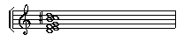
> >
> > ` 0.0 1 62 0 0`
> > `0.0 1 64 0 0`
> > `0.0 1 65 0 0`
> > `0.0 1 67 0 0`
> > `0.0 1 71 0 0`
> > `0.0 1 73 0 0`
> > `0.0 1 74 0 0`
> >
> > ` #38 (Extended Melody 'Ornament', same as Ex. 18) `
> >
> > 
> >
> > ` 0.00 1 60 80 1.0`
> > `0.50 1 60 80 2.0`
> > `1.50 1 62 80 1.0`
> > `2.00 1 63 80 0.4`
> > `2.25 1 65 72 0.4`
> > `2.50 1 63 76 0.4`
> > `2.75 1 62 72 0.4`
> >
> > 
> >
> > ` 3.00 1 60 80 0.4`
> > `3.25 1 60 76 0.6`
> > `3.50 1 60 80 2.0`
> > `4.50 1 62 80 0.4`
> > `4.75 1 62 76 0.4`
> > `5.00 1 63 80 0.4`
> > `5.25 1 65 72 0.4`
> > `5.50 1 62 76 0.4`
> > `5.75 1 63 72 0.4`
> >
> > 
> >
> > ` 6.00 1 60 80 2.1`
> > `7.00 1 58 80 2.1`
> > `8.00 1 57 73 0.4`
> > `8.25 1 58 74 0.4`
> > `8.75 1 60 76 0.4`
> >
> > 
> >
> > ` 9.000 1 62 77 0.4`
> > `9.125 1 65 78 0.4`
> > `9.250 1 63 79 0.4`
> > `9.375 1 67 80 0.4`
> > `9.500 1 69 81 0.3`
> > `9.600 1 72 82 0.3`
> > `9.700 1 70 83 0.3`
> > `9.800 1 74 84 0.3`
> > `9.900 1 75 75 0.3`
> > `10.00 1 74 88 0.3`
> > `10.17 1 72 87 0.3`
> > `10.34 1 70 86 0.3`
> > `10.50 1 66 86 0.4`
> > `10.75 1 66 83 0.4`
> > `11.00 1 66 88 1.0`
> > `11.50 1 66 84 0.4`
> > `11.75 1 66 80 0.4`
> >
> > - Try writing out the transpositions in full, starting on the nodal
> >   substructure pitch, but then using only the pitches in the
> >   Harmonic Set.
> > - This example shows that Mode **5** is best used for exact
> >   intervallic transpositions, and the other Modes for more
> >   unpredictable results.
> >
> > **Practical work:** This example illustrates the warping effect of
> > the Harmonic Set on an ornament, providing new, serendipitous
> > intervallic relationships. To explore this further try realising a
> > familiar round with each phrase as a separate ornament.
> >
> > The problem with separating the tune into different ornaments is
> > that either they all start on the same pitch (all nodes are at the
> > same pitch) or **any ornament** (selected at random) could start on
> > **any pitch** of the chord (the nodes use the different pitches of
> > the chord). This poses a challenging compositional problem! It may
> > be resolved by designing the phrases within a harmonic field concept
> > (not just a chord & scale concept) and then specifying that field as
> > a Harmonic Set (Mode **3**).
> >
> > **NB:** All ornaments start on the pitch of the specified nodal time
> > point, even if the ornament itself starts on a different pitch.
> > Sometimes it is useful to define all the ornaments as starting on
> > the same pitch and then use the same or different pitches for the
> > nodal time points.
>
> ## [Example 20]{#EXAMPLE20} -- repetitions of a (timed) nodal substructure, on the pitches (and at the times) of which fully defined 'ornaments' are attached, constrained to a Harmonic Set, with overlap of ornament and nodal substructure and time-varying tempo.
>
> > [**Play txws20.aiff**](txws20.aiff)  Parameters:
> > [**txwspla5-MAC.htm**](txwspla5-MAC.htm)
> > ([**Play txws20b.aiff**](txws20b.aiff)  uses
> > [**whirrdtgd.aiff**](whirrdtgd.aiff) as the input soundfile.)
> >
> > TEXTURE POSTORNATE, Mode **3**. The note data file
> > [*txws20nd.txt*](txws20nd.txt) with Nodal Substructure, Harmonic Set
> > and Ornament reads:
> >
> > ` 60`
> > `#17 (Nodal Substructure) `
> >
> > 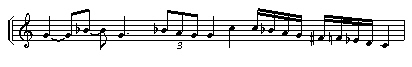
> >
> > ` 0.00 1 67 0 0`
> > `1.50 1 70 0 0`
> > `2.50 1 67 0 0`
> > `4.00 1 70 0 0`
> > `4.34 1 69 0 0`
> > `4.67 1 67 0 0`
> > `5.00 1 67 0 0`
> > `6.00 1 72 0 0`
> > `7.00 1 72 0 0`
> > `7.25 1 70 0 0`
> > `7.50 1 69 0 0`
> > `7.75 1 67 0 0`
> > `8.00 1 66 0 0`
> > `8.25 1 65 0 0`
> > `8.50 1 63 0 0`
> > `8.75 1 62 0 0`
> > `9.00 1 60 0 0`
> >
> > ` #13 (Harmonic Set) `
> >
> > 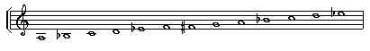
> >
> > ` 0.0 1 57 0 0`
> > `0.0 1 58 0 0`
> > `0.0 1 60 0 0`
> > `0.0 1 62 0 0`
> > `0.0 1 63 0 0`
> > `0.0 1 65 0 0`
> > `0.0 1 66 0 0`
> > `0.0 1 67 0 0`
> > `0.0 1 69 0 0`
> > `0.0 1 70 0 0`
> > `0.0 1 72 0 0`
> > `0.0 1 74 0 0`
> > `0.0 1 75 0 0`
> >
> > ` #15 ('Tremolo' ornament) `
> >
> > 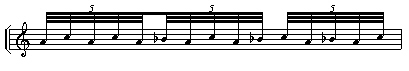
> >
> > ` 0.0 1 69 80 0.3`
> > `0.1 1 72 76 0.3`
> > `0.2 1 69 78 0.3`
> > `0.3 1 72 76 0.3`
> > `0.4 1 69 76 0.3`
> > `0.5 1 70 78 0.3`
> > `0.6 1 69 76 0.3`
> > `0.7 1 72 78 0.3`
> > `0.8 1 69 76 0.3`
> > `0.9 1 70 76 0.3`
> > `1.0 1 72 80 0.3`
> > `1.1 1 69 76 0.3`
> > `1.2 1 70 78 0.3`
> > `1.3 1 69 76 0.3`
> > `1.4 1 72 76 0.3`
> >
> > - The ornament here is a tremolo effect based on 3^rds^. It is
> >   designed to maintain a sonorous harmonic 'feel' when used with a
> >   harmonic set, even when there is quite a bit of overlap.
> > - Indeed, overlap is built in by making use of time-varying *mult*
> >   files to play around with the tempo:
> >   [*txws20ml.brk*](txws20ml.brk) and [*txws20mh.brk*](txws20mh.brk).
> >   For the first 12 seconds, *mult* is 2 in both files, causing the
> >   quintuplets to last for 1 second instead of ½ sec. The 2^nd^ nodal
> >   time point therefore arrives in the middle of a quintuplet --
> >   between notes -- and the result is a 3^rd^ entity of dancing
> >   figures.
> > - The 2^nd^ half of the *mult* breakpoint files separates the lo -
> >   hi tempo a little bit, the lo moving down to 1.9 and the hi up to
> >   2.1. Thus the repeat of the figure is going to be a little
> >   different.
> > - Try a version with *mult* = 1 for both lo and hi values. This
> >   clearly illustrates the difference between a 'straight'
> >   rendition of the ornament and a more playful approach.
> > - The nodal substructure outlines a clear linear pattern, but the
> >   rapid descent through an 8^ve^ in semi-quavers is a deliberate
> >   attempt to create a textural, cascading effect.
> > - If you try a version with lo and hi *mult* both set to 0.25, you
> >   will be able to hear a confirmation that *mult* affects the speed
> >   of the ornaments, but does not alter the timing of the nodal
> >   substructure. In this case you would hear very rapid ornaments
> >   plus some gaps. Our example, with *mult* slowing down the
> >   ornaments and causing them to overlap the nodal substructure,
> >   shows how this feature can be used to advantage.
> >
> > **Practical work:** It is important to consider the relationship of
> > the design of the figure and that of the nodal substructure -- not
> > to mention that of the input sound itself. It is possible to create
> > all manner of clearly shaped textural effects in which the figure is
> > a contributor but is no longer heard as such.
> >
> > Explore this with:
> >
> > - a figure with many repeated notes and a strong rhythm, coupled
> >   with a nodal substructure with compressing durations
> > - a figure with a richly melodic turn of phrase and a nodal
> >   substructure which is widely spread both in pitch and in time
> > - a roughly granulated sound and a nodal substructure which forms a
> >   tight cluster: expanding rapidly from a single point to a set of
> >   pitches close to each other and then returning to a single point.
> >
> > The *mult* tempo parameter is a very important tool. Making use of
> > several ornaments -- which will be selected at random -- and
> > supplying multiple input soundfiles expand the complexity and
> > richness of the textures which can be created. Try this with the 3
> > rd recommended exercise above (with the granulated
> > sound).
>
> ------------------------------------------------------------------------
>
> ## [Example 21]{#EXAMPLE21} -- a transformed sound is matched to a texture framework design.
>
> > [**Play txws21.aiff**](tz5s2tex3.aiff)
> >  [**txwsplay-MAC.htm**](txwsplay-MAC.htm)
> >
> > TEXTURE SIMPLE, Mode **3**. The note data file
> > [*ndftz5s2.txt*](ndftz5s2.txt) with a 3-note Harmonic Set reads:
> >
> > ` 67`
> > `#3 (Harmonic Set) `
> >
> > 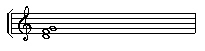
> >
> > ` 0 1 67 0 0`
> > `0 1 64 0 0`
> > `0 1 62 0 0 `
> >
> > This example is taken from my composition *Crossing the Dark Rift*
> > (2002), Section 2 of Tzolkin cycle 5. A visual image of obliquely
> > descending parallel squiggly lines was the starting point. A
> > sequence of sound transformations created the squiggly lines, and
> > then TEXTURE SIMPLE put them together.
> >
> > This is a good example of how a sound is adapted in order to help
> > realise the intended shape.
> >
> > The input soundfile was pre-prepared so that it was long and wiggly.
> > Some [**'waver'**](bdtg5wavr.aiff) was added to the original 5 sec
> > Tibetan bowl sound, then it was stretched 2.3 times and subjected to
> > a time-varying inharmonic shift by which its frequencies were first
> > pushed very high and then gradually brought down to near its
> > original pitch; finally, time varying vibrato was added, moving from
> > 1 to 30 over 11 sec. This is the result:
> > [**bdtg5wavrstrx2&3ssvib.aiff**](bdtg5wavrstrx2&3ssvib.aiff).
> >
> > The TEXTURE program is now employed to pack these descending streams
> > close together. The Harmonic Set is G-F-D, and the pitch range is
> > set to 62-67 to keep the output within this range. The note events
> > are selected at random from the Harmonci Set and packed at 0.1
> > seconds over the 10 sec. output duration, with a bit of scatter. The
> > *whole soundfile* is used. The onsets end at 10 sec., and then the
> > whole soundfile note-events play out for another 14 seconds.
> >
> > The combination of the complex source, high density, chord formation
> > due to the tightly overlapping note-events, and use of the entire
> > length of the input soundfile for every note-event serves to create
> > a very dense texture. The texture descends because the sound itself
> > does so. The descent could have been achieved by giving changing
> > times to the Harmonic Set, but this would have made the texture
> > thinner (no chord).
>
> Last updated: 14 October 2005
>
> ------------------------------------------------------------------------
>
> **©2002 Archer Endrich, HITHER GATE
> MUSIC, Chippenham, Wiltshire
> SN14 0SY** -- **archer@trans4um.demon.co.uk**
>
> ------------------------------------------------------------------------
